# DBスキーマ

Drizzle ORM で定義されたテーブル一覧と関係図。定義元: `apps/server/src/infrastructure/db/schema.ts`

## テーブル一覧

### コアテーブル

| テーブル        | 説明                                       | 主キー  |
| --------------- | ------------------------------------------ | ------- |
| `media_sources` | ストレージバックエンド（local/sftp/s3）    | UUID    |
| `media`         | メディアファイル本体（パス・サイズ・種別） | UUID    |
| `tags`          | タグマスター                               | UUID    |
| `authors`       | 作者・アーティストマスター                 | UUID    |
| `characters`    | キャラクターマスター                       | UUID    |
| `ips`           | 知的財産（作品）マスター                   | UUID    |
| `categories`    | カテゴリマスター（階層構造可）             | UUID    |
| `projects`      | プロジェクトマスター                       | UUID    |
| `users`         | ユーザーアカウント                         | UUID    |
| `collections`   | ユーザー作成コレクション                   | UUID    |
| `presets`       | 検索フィルタープリセット                   | serial  |
| `jobs`          | バックグラウンドジョブ                     | UUID    |

### メディア詳細テーブル（media との 1:1）

| テーブル                | 説明                                          |
| ----------------------- | --------------------------------------------- |
| `media_details`         | 評価・お気に入り・閲覧回数                    |
| `media_generation_info` | AI生成情報（プロンプト・モデル・seed・CFG等） |
| `media_technical_info`  | 技術情報（ハッシュ・EXIF・動画コーデック等）  |
| `media_sync`            | 同期・バックアップ状態                        |

### 中間テーブル（N:M）

命名規則: `media_{entity}` または `{entity1}_{entity2}`

| テーブル            | 関係                | 追加フィールド                                  |
| ------------------- | ------------------- | ----------------------------------------------- |
| `media_tags`        | media ↔ tags        | tagType (positive/negative), confidence, source |
| `media_characters`  | media ↔ characters  | confidence, source                              |
| `media_ips`         | media ↔ ips         | confidence, source                              |
| `media_authors`     | media ↔ authors     | —                                               |
| `media_categories`  | media ↔ categories  | —                                               |
| `media_projects`    | media ↔ projects    | —                                               |
| `media_collections` | collections ↔ media | displayOrder                                    |
| `media_urls`        | media ← urls (1:N)  | url, createdAt                                  |
| `character_ips`     | characters ↔ ips    | source                                          |

### 分析・関係テーブル

| テーブル          | 説明                                                                              |
| ----------------- | --------------------------------------------------------------------------------- |
| `media_relations` | メディア間の関係（バリアント・マンガページ等）。relationType: variant/page/series |
| `similar_media`   | 知覚ハッシュによる類似メディアペア。algorithmフィールドあり                       |
| `view_history`    | 閲覧履歴（mediaId・viewedAt・ipAddress）                                          |

## ER図

media を中心としたリレーション。詳細カラムは省略。

```mermaid
erDiagram
    media_sources ||--o{ media : "has"
    media ||--o| media_details : "1:1"
    media ||--o| media_generation_info : "1:1"
    media ||--o| media_technical_info : "1:1"
    media ||--o| media_sync : "1:1"

    media ||--o{ media_tags : ""
    tags  ||--o{ media_tags : ""
    tags  }o--|| authors   : "authored_by"

    media      ||--o{ media_characters : ""
    characters ||--o{ media_characters : ""
    characters ||--o{ character_ips   : ""
    ips        ||--o{ character_ips   : ""

    media ||--o{ media_ips        : ""
    ips   ||--o{ media_ips        : ""
    media ||--o{ media_authors    : ""
    authors ||--o{ media_authors  : ""
    media ||--o{ media_categories : ""
    categories ||--o{ media_categories : ""
    categories ||--o{ categories  : "parent/child"

    media ||--o{ media_projects   : ""
    projects ||--o{ media_projects : ""

    media ||--o{ media_urls       : ""
    media ||--o{ view_history     : ""

    media ||--o{ media_relations  : "parent"
    media ||--o{ media_relations  : "child"
    media ||--o{ similar_media    : "media1"
    media ||--o{ similar_media    : "media2"

    users ||--o{ collections      : "owns"
    collections ||--o{ media_collections : ""
    media       ||--o{ media_collections : ""

    media_sources ||--o{ jobs     : "optional"
    jobs ||--o{ jobs              : "parent/child"
```



### 補足

- `media_tags` は `(mediaId, tagId, tagType)` 複合主キー。同一タグを positive/negative 両方で付与可能。
- `media_relations` は `media` の自己参照 N:M。`relationType` でバリアント・ページ・派生を区別。
- `similar_media` は対称的だがストレージは非対称（`media1_id` / `media2_id`）。検索時は両側の UNION が必要。
- `jobs.parentId` によるバッチジョブのツリー構造、`mediaSourceId` は任意。

## Enum一覧

| Enum                        | 値                                                           |
| --------------------------- | ------------------------------------------------------------ |
| `media_source_type`         | `local`, `sftp`, `s3`                                        |
| `media_type`                | `image`, `video`, `audio`                                    |
| `media_organization_status` | `active`, `archived`, `deleted`                              |
| `media_sync_status`         | `synced`, `pending`, `failed`                                |
| `job_status`                | `pending`, `in_progress`, `completed`, `failed`              |
| `media_relation_type`       | `variant`, `version`, `page`, `derivative`, `edit`, `source` |
| `tag_type`                  | `positive`, `negative`                                       |

## 設計上の重要な決まり

- **全テーブルUUID v4** (`gen_random_uuid()`)。ただし `presets` は serial
- **cascade delete**: メディアソース削除 → メディア削除 → 全関連レコード削除
- **中間テーブル命名**: `media_{entity}` で統一（`media_tags`, `media_characters` 等）
- **confidence フィールド**: AI由来の関連付けには `real(0.0-1.0)` の信頼度を保存。手動の場合は NULL
- **source フィールド**: データの起源を記録（`"manual"`, `"comfyui_workflow"`, `"tagger_program_A"` 等）
- **`media_generation_info.metadata`**: ComfyUIワークフロー全体をJSONBで保存可能

## マイグレーション

```bash
# マイグレーションファイル生成
bun --filter @solid-imager/server run db:generate

# 適用
bun --filter @solid-imager/server run db:migrate
```

ファイル: `apps/server/drizzle/` (0000〜0012)  
Tauriは同じSQLファイルをWasm経由（PGlite）で共有利用。
