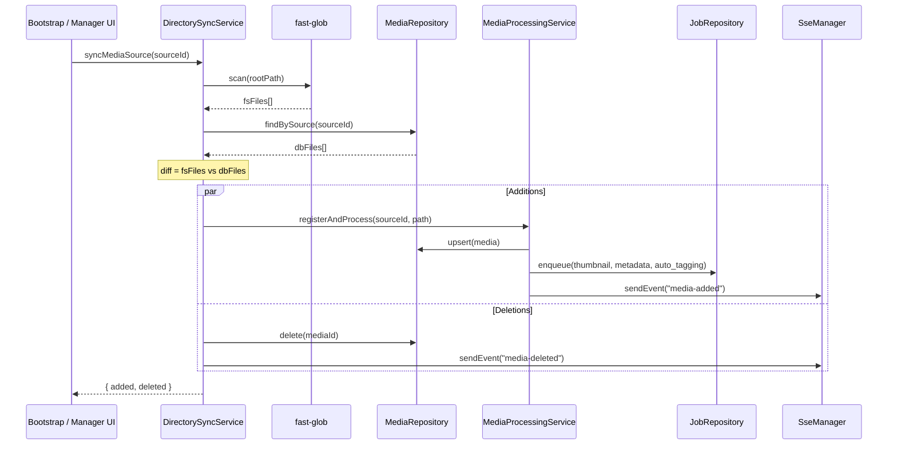
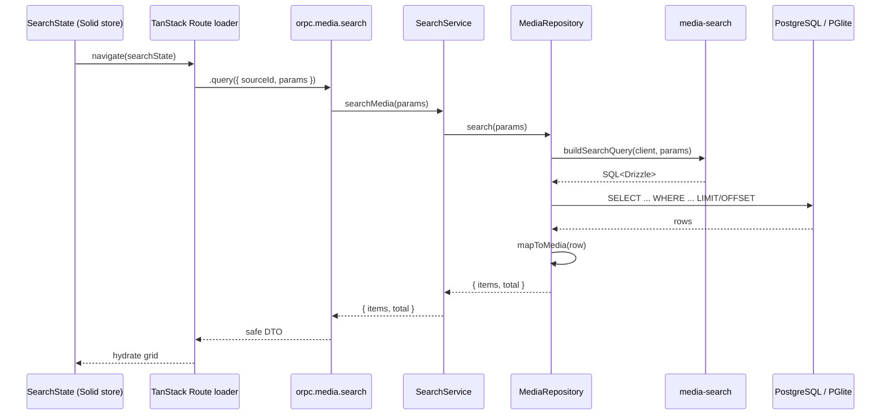
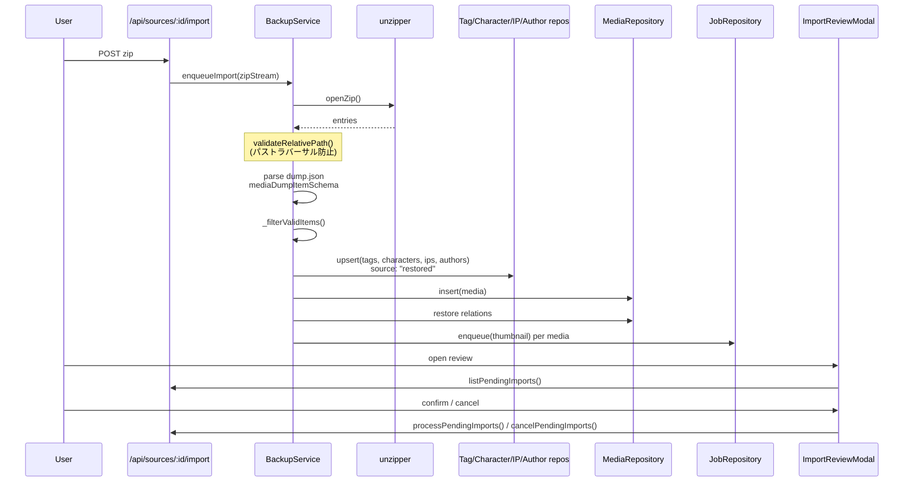
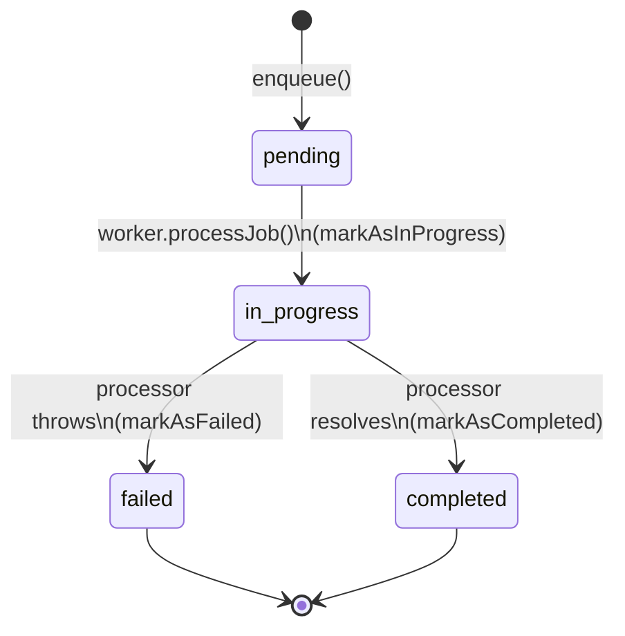
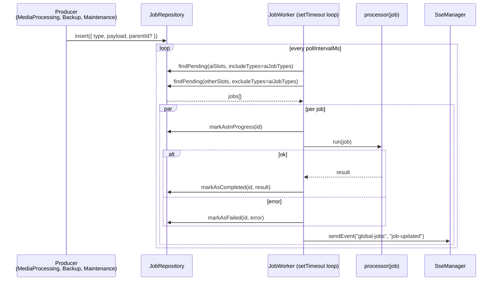
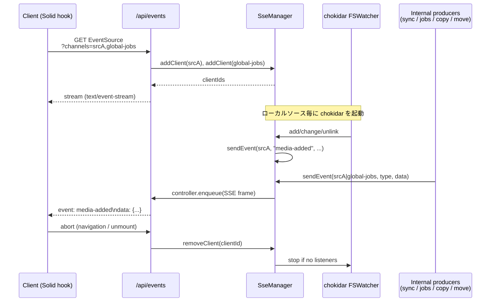
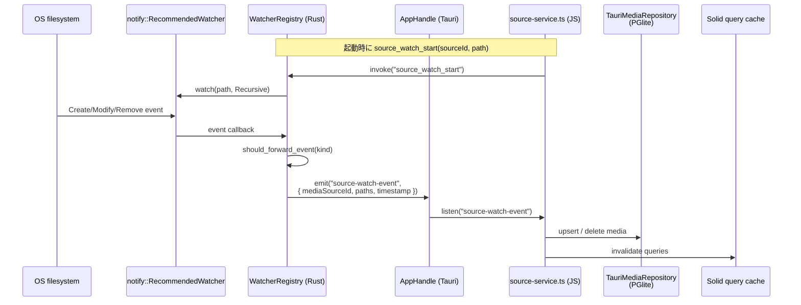

# 処理フロー

主要な処理経路をシーケンス図で示す。Mermaid で描画される。各図の直下に登場する実装ファイルへのリンクを置くので、図と併読すること。

---

## 1. メディア同期（ローカルソース）

起動時 / 手動トリガー時に、ファイルシステムとDBを突き合わせて差分を反映する。

**実装**

- `apps/server/src/application/services/directory-sync-service.ts`
- `apps/server/src/application/services/media-processing-service.ts` — `registerAndProcess()`
- Tauri 側は `apps/tauri/src/infrastructure/local-api/services/source-service.ts` の `syncSource*` が同じ責務を担う（FS は Rust コマンド、DB は PGlite）。

---

## 2. 検索クエリ

`SearchState`（Zod）を入力に、Drizzle で動的 SQL を組み立てる。

**実装**

- スキーマ: `packages/core/src/domain/search/schema.ts`
- モード変換: `packages/core/src/domain/search/logic.ts` (`calculateNextModeState`)
- SQL 構築: `packages/db/src/repositories/media-search.ts` (`buildSearchQuery`)
- プリセット自動保存: `apps/server/src/hooks/use-current-search-persistence.ts` （1000ms デバウンス）

---

## 3. インポート / リストア

`POST /api/sources/:id/import` にZIPをアップロード → バックグラウンドで復元 → UI でレビュー。

**実装**

- サーバー: `apps/server/src/application/services/backup-service.ts`
- Tauri: `apps/tauri/src/infrastructure/local-api/services/source-backup-service.ts` + `src-tauri/src/commands/backup.rs`
- ZIP レイアウト・dump schema は [backup-restore.md](./backup-restore.md) 参照

---

## 4. ジョブキュー

Postgres の `jobs` テーブルをキューとして、`JobWorker` が定期ポーリング。AIジョブと通常ジョブを独立プールで制御。

**実装**

- ワーカー: `apps/server/src/infrastructure/jobs/job-worker.ts`
- ディスパッチ: `apps/server/src/application/services/job-dispatch-service.ts`
- キュー API: `apps/server/src/infrastructure/jobs/job-queue.ts`
- AI専用プール: `aiJobTypes = ["auto_tagging"]`（他ジョブと並行動作）
- `concurrency` / `aiConcurrency` / `pollIntervalMs` は `AppConfig.jobs` で動的変更可能

---

## 5. SSE リアルタイム更新

`/api/events?channels=<sourceId>,global-jobs` にクライアントが接続し、サーバー側のイベントを受信する。

**実装**

- エンドポイント: `apps/server/src/routes/api/events.ts`
- マネージャ: `apps/server/src/infrastructure/jobs/sse-manager.ts`
- HMR 耐性のため clients / watchers / emitter は `globalThis` に保持
- イベント種別（抜粋）: `media-added`, `media-deleted`, `media-changed`, `media-copied`, `media-moved`, `thumbnail-generated`, `watcher-error`, `job-*`

---

## 6. Tauri ファイルウォッチャー

サーバーの chokidar 相当を Rust `notify` で実装。変更は Tauri イベントで JS 側に配信される。

**実装**

- Rust: `apps/tauri/src-tauri/src/watcher.rs` (`source_watch_start` / `source_watch_stop` コマンド、`WatcherRegistry`)
- JS 受信: `apps/tauri/src/infrastructure/local-api/services/source-service.ts`
- フォワード対象イベント: `should_forward_event()` が Create/Modify/Remove の主要バリアントを通過させる
- リトライ: JS 側で起動失敗時に `WATCH_START_RETRY_DELAY_MS` で再試行

---

## 参考

- [architecture.md](./architecture.md) — 全体アーキテクチャ
- [orpc-flow.md](./orpc-flow.md) — oRPC リクエスト経路
- [db-schema.md](./db-schema.md) — テーブル定義と ER 図
- [search-design.md](./search-design.md) — 検索スキーマ詳細
- [backup-restore.md](./backup-restore.md) — ダンプ形式
