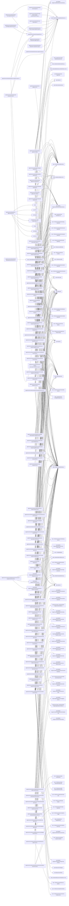

# solid-imager detail 02 - server tests

## Diagram 1

```mermaid
graph LR
  N0["apps/server/src/tests/api/categories/category-id-test.ts"]
  N1["node_modules/vitest/dist/index.js"]
  N2["npm:~/infrastructure/db/schema"]
  N3["apps/server/src/tests/api/categories/index.test.ts"]
  N4["apps/server/src/tests/api/characters/character-id-test.ts"]
  N5["apps/server/src/tests/api/ips/ip-id-test.ts"]
  N6["apps/server/src/tests/api/media/add-media.test.ts"]
  N7["npm:@solid-imager/core/domain/media/schemas"]
  N8["node_modules/zod/index.d.cts"]
  N9["apps/server/src/tests/api/media/delete-media.test.ts"]
  N10["npm:@solid-imager/core/domain/sources/schemas"]
  N11["apps/server/src/tests/api/media/get-media.test.ts"]
  N12["apps/server/src/tests/api/media/list-media.test.ts"]
  N13["apps/server/src/tests/api/tags/index.test.ts"]
  N14["apps/server/src/tests/api/tags/tag-id-test.ts"]
  N15["apps/server/src/tests/e2e/app-nav.responsive.spec.ts"]
  N16["node_modules/@playwright/test/index.d.ts"]
  N17["apps/server/src/tests/e2e/support/test.ts"]
  N18["apps/server/src/tests/e2e/loading-recovery.spec.ts"]
  N19["apps/server/src/tests/e2e/media-detail-manager-config.responsive.spec.ts"]
  N20["apps/server/src/tests/e2e/realtime-preservation.spec.ts"]
  N21["npm:node:crypto"]
  N22["npm:node:fs/promises"]
  N23["npm:node:path"]
  N24["apps/server/src/tests/e2e/route-reload.spec.ts"]
  N25["apps/server/src/tests/e2e/search-pro-dialog.responsive.spec.ts"]
  N26["apps/server/src/tests/e2e/search-realtime-preservation.responsive.spec.ts"]
  N27["apps/server/src/tests/e2e/search.responsive.spec.ts"]
  N28["apps/server/src/tests/e2e/support/fixture.ts"]
  N29["apps/server/src/tests/e2e/sources-source-media.responsive.spec.ts"]
  N30["apps/server/src/tests/e2e/ui-components.gallery.spec.ts"]
  N31["apps/server/src/tests/e2e/ui-gallery/index.html"]
  N32["url:ja"]
  N33["url:UTF-8"]
  N34["url:viewport"]
  N35["url:width=device-width, initial-scale=1.0"]
  N36["url:root"]
  N37["url:module"]
  N38["url:src.tsx"]
  N39["apps/server/src/tests/e2e/ui-gallery/src.tsx"]
  N40["apps/server/src/tests/e2e/ui-gallery/vite.config.ts"]
  N41["npm:node:url"]
  N42["node_modules/@tailwindcss/vite/dist/index.d.mts"]
  N43["node_modules/sharp/dist/index.cjs"]
  N44["node_modules/vite/dist/node/index.js"]
  N45["node_modules/vite-plugin-solid/dist/cjs/index.cjs"]
  N46["apps/server/src/tests/e2e/interface-interactions.responsive.spec.ts"]
  N47["apps/server/src/tests/e2e/tauri-app/adapters/persistence.ts"]
  N48["node_modules/@tanstack/db/dist/cjs/index.cjs"]
  N49["apps/server/src/tests/e2e/tauri-app/vite.config.ts"]
  N50["npm:node:fs"]
  N51["npm:@tanstack/router-plugin/vite"]
  N52["apps/server/src/tests/e2e/tauri-app/serve-production.ts"]
  N53["apps/server/src/tests/e2e/routes.responsive.spec.ts"]
  N54["apps/server/src/tests/e2e/scroll-restoration.spec.ts"]
  N55["apps/server/src/tests/e2e/tauri-migration.spec.ts"]
  N56["npm:node:os"]
  N57["apps/server/src/tests/integration/backup/backup-service.test.ts"]
  N58["node_modules/drizzle-orm/index.d.ts"]
  N59["npm:~/infrastructure/db"]
  N60["apps/server/src/tests/integration/backup/performance.test.ts"]
  N61["apps/server/src/tests/integration/backup/zip-backup.test.ts"]
  N62["npm:node:stream/promises"]
  N63["apps/server/src/tests/integration/db/pglite-parity.test.ts"]
  N64["npm:~/config/database"]
  N65["apps/server/src/tests/integration/media/access-denied-integration.test.ts"]
  N66["npm:~/infrastructure/ai/rust-ai-client"]
  N67["npm:~/infrastructure/processing/image-processor"]
  N68["npm:~/infrastructure/repositories/author-repository"]
  N69["npm:~/infrastructure/repositories/character-repository"]
  N70["npm:~/infrastructure/repositories/ip-repository"]
  N71["npm:~/infrastructure/repositories/media-repository"]
  N72["npm:~/infrastructure/repositories/project-repository"]
  N73["npm:~/infrastructure/repositories/source-repository"]
  N74["npm:~/infrastructure/repositories/tag-repository"]
  N75["npm:~/infrastructure/service-registry"]
  N76["npm:~/infrastructure/services/media-service"]
  N77["npm:~/infrastructure/storage/server-media-storage"]
  N78["apps/server/src/tests/integration/media/add-media-integration.test.ts"]
  N79["npm:~/infrastructure/db/index"]
  N80["apps/server/src/tests/integration/media/copy-media-integration.test.ts"]
  N81["apps/server/src/tests/integration/media/delete-media-integration.test.ts"]
  N82["apps/server/src/tests/integration/media/get-media-details-integration.test.ts"]
  N83["apps/server/src/tests/integration/media/get-media-integration.test.ts"]
  N84["apps/server/src/tests/integration/media/list-media-integration.test.ts"]
  N85["apps/server/src/tests/integration/media/media-type-handling.test.ts"]
  N86["apps/server/src/tests/integration/media/register-media-integration.test.ts"]
  N87["apps/server/src/tests/integration/media/update-media-integration.test.ts"]
  N88["apps/server/src/tests/integration/queries/search.test.ts"]
  N89["apps/server/src/tests/integration/repository/author-dedupe.test.ts"]
  N90["node_modules/drizzle-orm/pglite/migrator.d.ts"]
  N91["apps/server/src/tests/integration/repository/character-repository.test.ts"]
  N92["apps/server/src/tests/integration/security/backup-security.test.ts"]
  N93["npm:~/infrastructure/services/backup-service"]
  N94["apps/server/src/tests/integration/security/path-traversal.test.ts"]
  N95["apps/server/src/tests/integration/ai/postgres-ccip-vector-store.test.ts"]
  N96["npm:@solid-imager/application/ports/ccip-vector-store"]
  N97["apps/server/src/tests/monorepo-migration.test.ts"]
  N98["apps/server/src/tests/setup-integration.ts"]
  N99["node_modules/dotenv/lib/main.d.ts"]
  N100["apps/server/src/tests/setup-unit.ts"]
  N101["apps/server/src/tests/setup.ts"]
  N102["apps/server/src/tests/unit/application/registry.test.ts"]
  N103["apps/server/src/tests/unit/application/services/backup-service.test.ts"]
  N104["apps/server/src/tests/unit/application/services/character-service.test.ts"]
  N105["apps/server/src/tests/unit/application/services/directory-sync-service.test.ts"]
  N106["apps/server/src/tests/unit/application/services/media-service.test.ts"]
  N107["npm:@solid-imager/application/services/media-query-service"]
  N108["npm:@solid-imager/application/services/media-transfer-service"]
  N109["npm:@solid-imager/application/services/media-upload-service"]
  N110["apps/server/node_modules/@solid-imager/core/src/index.ts"]
  N111["npm:@solid-imager/core/domain/repositories/author-repository"]
  N112["npm:@solid-imager/core/domain/repositories/character-repository"]
  N113["npm:@solid-imager/core/domain/repositories/ip-repository"]
  N114["npm:@solid-imager/core/domain/repositories/job-repository"]
  N115["npm:@solid-imager/core/domain/repositories/media-repository"]
  N116["npm:@solid-imager/core/domain/repositories/project-repository"]
  N117["npm:@solid-imager/core/domain/repositories/source-repository"]
  N118["npm:@solid-imager/core/domain/repositories/tag-repository"]
  N119["npm:@solid-imager/core/domain/services/image-processor"]
  N120["npm:~/infrastructure/db/transaction-manager"]
  N121["apps/server/src/tests/unit/application/services/ccip-vector-service.test.ts"]
  N122["npm:@solid-imager/application/services/ccip-vector-service"]
  N123["apps/server/src/tests/unit/application/services/maintenance-service.test.ts"]
  N124["apps/server/src/tests/unit/application/services/media-processing-service.test.ts"]
  N125["npm:~/infrastructure/services/media-processing-service"]
  N126["apps/server/src/tests/unit/application/services/tagging-service.test.ts"]
  N127["npm:@solid-imager/application/services/tagging-service"]
  N128["npm:@solid-imager/core/domain/interfaces/ai-client"]
  N129["apps/server/src/tests/unit/application/services/job-dispatch-service.test.ts"]
  N130["apps/server/src/tests/unit/application/services/job-transfer-storage.test.ts"]
  N131["apps/server/src/tests/unit/application/services/search-snapshot-service.test.ts"]
  N132["npm:@solid-imager/application/services/search-snapshot-service"]
  N133["npm:@solid-imager/core/domain/errors"]
  N134["npm:@solid-imager/core/domain/repositories/search-snapshot-repository"]
  N135["apps/server/src/tests/unit/config/database.test.ts"]
  N136["apps/server/src/tests/unit/db/connection.test.ts"]
  N137["apps/server/src/tests/unit/domain/media/schemas.test.ts"]
  N138["apps/server/src/tests/unit/domain/media/utils/hash-utils.test.ts"]
  N139["apps/server/node_modules/@solid-imager/application/src/index.ts"]
  N140["apps/server/src/tests/unit/domain/media/utils/metadata-utils.test.ts"]
  N141["npm:@solid-imager/core/domain/media/utils/metadata-utils"]
  N142["apps/server/src/tests/unit/domain/search-mode-transition.test.ts"]
  N143["npm:@solid-imager/core/domain/search/logic"]
  N144["apps/server/src/tests/unit/infrastructure/api-clients/ai-api.test.ts"]
  N145["npm:~/infrastructure/api-clients/ai-api"]
  N146["apps/server/src/tests/unit/infrastructure/api-clients/downloads-api.test.ts"]
  N147["npm:~/infrastructure/api-clients/downloads-api"]
  N148["apps/server/src/tests/unit/infrastructure/api-clients/sources-api-ext.test.ts"]
  N149["apps/server/src/tests/unit/infrastructure/file-system/node-file-system.test.ts"]
  N150["npm:~/infrastructure/file-system/node-file-system"]
  N151["apps/server/src/tests/unit/infrastructure/jobs/download-jobs.test.ts"]
  N152["npm:~/infrastructure/jobs/download-jobs"]
  N153["apps/server/src/tests/unit/infrastructure/jobs/download-rate-limiter.test.ts"]
  N154["apps/server/src/tests/unit/infrastructure/jobs/job-worker.test.ts"]
  N155["npm:@solid-imager/core/domain/config/config-schema"]
  N156["npm:~/domain/repositories/job-repository"]
  N157["npm:~/infrastructure/jobs/job-worker"]
  N158["apps/server/src/tests/unit/infrastructure/jobs/ccip-jobs.test.ts"]
  N159["apps/server/src/tests/unit/infrastructure/jobs/tagging-jobs.test.ts"]
  N160["apps/server/src/tests/unit/infrastructure/storage/server-media-storage.test.ts"]
  N161["node_modules/fluent-ffmpeg/index.js"]
  N162["npm:~/infrastructure/processing/bun-image"]
  N163["apps/server/src/tests/unit/infrastructure/storage/server-media-storage-formats.test.ts"]
  N164["apps/server/src/tests/unit/infrastructure/events/realtime-event-bus.test.ts"]
  N165["npm:@solid-imager/core/domain/sources/events"]
  N166["npm:~/infrastructure/events/realtime-event-bus"]
  N167["apps/server/src/tests/unit/infrastructure/api/rpc-response-headers.test.ts"]
  N168["node_modules/@orpc/server/dist/index.d.mts"]
  N169["npm:@orpc/server/fetch"]
  N170["npm:@orpc/server/plugins"]
  N171["npm:~/infrastructure/api/rpc-response-headers"]
  N172["apps/server/src/tests/unit/infrastructure/ai/inference-options.test.ts"]
  N173["npm:~/infrastructure/ai/inference-options"]
  N174["apps/server/src/tests/unit/infrastructure/processing/image-processor.test.ts"]
  N175["apps/server/src/tests/unit/media/copy-media-job.test.ts"]
  N176["npm:~/infrastructure/jobs/thumbnails"]
  N177["apps/server/src/tests/unit/security/file-validation.test.ts"]
  N178["apps/server/src/tests/unit/server-config-service.test.ts"]
  N179["npm:~/infrastructure/services/server-config-service"]
  N0 --> N1
  N0 --> N2
  N3 --> N1
  N3 --> N2
  N4 --> N1
  N4 --> N2
  N5 --> N1
  N5 --> N2
  N6 --> N7
  N6 --> N1
  N6 --> N8
  N6 --> N2
  N9 --> N7
  N9 --> N10
  N9 --> N1
  N9 --> N8
  N11 --> N7
  N11 --> N10
  N11 --> N1
  N11 --> N8
  N11 --> N2
  N12 --> N7
  N12 --> N10
  N12 --> N1
  N12 --> N8
  N12 --> N2
  N13 --> N1
  N13 --> N2
  N14 --> N1
  N14 --> N2
  N15 --> N16
  N15 --> N17
  N18 --> N16
  N19 --> N16
  N20 --> N21
  N20 --> N22
  N20 --> N23
  N20 --> N16
  N24 --> N16
  N25 --> N17
  N26 --> N21
  N26 --> N22
  N26 --> N23
  N27 --> N16
  N27 --> N28
  N27 --> N17
  N29 --> N16
  N28 --> N23
  N17 --> N16
  N30 --> N16
  N31 --> N32
  N31 --> N33
  N31 --> N34
  N31 --> N35
  N31 --> N36
  N31 --> N37
  N31 --> N38
  N39 --> N7
  N40 --> N23
  N40 --> N41
  N40 --> N42
  N40 --> N43
  N40 --> N44
  N40 --> N45
  N46 --> N16
  N47 --> N48
  N49 --> N50
  N49 --> N23
  N49 --> N41
  N49 --> N42
  N49 --> N51
  N49 --> N44
  N49 --> N45
  N52 --> N23
  N52 --> N41
  N53 --> N16
  N54 --> N16
  N54 --> N28
  N54 --> N17
  N55 --> N22
  N55 --> N56
  N55 --> N23
  N55 --> N16
  N57 --> N22
  N57 --> N58
  N57 --> N1
  N57 --> N59
  N60 --> N58
  N60 --> N1
  N60 --> N59
  N61 --> N50
  N61 --> N22
  N61 --> N56
  N61 --> N23
  N61 --> N62
  N61 --> N58
  N61 --> N1
  N61 --> N59
  N63 --> N50
  N63 --> N23
  N63 --> N1
  N63 --> N64
  N65 --> N1
  N65 --> N66
  N65 --> N67
  N65 --> N68
  N65 --> N69
  N65 --> N70
  N65 --> N71
  N65 --> N72
  N65 --> N73
  N65 --> N74
  N65 --> N75
  N65 --> N76
  N65 --> N77
  N78 --> N58
  N78 --> N1
  N78 --> N79
  N78 --> N2
  N78 --> N71
  N80 --> N58
  N80 --> N1
  N80 --> N79
  N81 --> N58
  N81 --> N1
  N81 --> N8
  N81 --> N66
  N81 --> N79
  N81 --> N2
  N81 --> N67
  N81 --> N68
  N81 --> N69
  N81 --> N70
  N81 --> N71
  N81 --> N72
  N81 --> N73
  N81 --> N74
  N81 --> N75
  N81 --> N76
  N81 --> N77
  N82 --> N22
  N82 --> N23
  N83 --> N1
  N83 --> N8
  N83 --> N66
  N83 --> N79
  N83 --> N2
  N83 --> N67
  N83 --> N68
  N83 --> N69
  N83 --> N70
  N83 --> N71
  N83 --> N72
  N83 --> N73
  N83 --> N74
  N83 --> N75
  N83 --> N76
  N83 --> N77
  N84 --> N1
  N84 --> N8
  N84 --> N66
  N84 --> N79
  N84 --> N2
  N84 --> N67
  N84 --> N68
  N84 --> N69
  N84 --> N70
  N84 --> N71
  N84 --> N72
  N84 --> N73
  N84 --> N74
  N84 --> N75
  N84 --> N76
  N84 --> N77
  N85 --> N22
  N85 --> N23
  N86 --> N22
  N86 --> N23
  N86 --> N1
  N86 --> N79
  N87 --> N58
  N87 --> N1
  N87 --> N8
  N87 --> N66
  N87 --> N79
  N87 --> N2
  N87 --> N67
  N87 --> N68
  N87 --> N69
  N87 --> N70
  N87 --> N71
  N87 --> N72
  N87 --> N73
  N87 --> N74
  N87 --> N75
  N87 --> N76
  N87 --> N77
  N88 --> N1
  N88 --> N59
  N89 --> N58
  N89 --> N90
  N89 --> N1
  N89 --> N59
  N89 --> N2
  N89 --> N68
  N91 --> N58
  N91 --> N90
  N91 --> N1
  N91 --> N59
  N91 --> N2
  N91 --> N69
  N92 --> N1
  N92 --> N93
  N94 --> N22
  N94 --> N23
  N94 --> N1
  N94 --> N77
  N95 --> N23
  N95 --> N96
  N97 --> N50
  N97 --> N23
  N97 --> N1
  N98 --> N23
  N98 --> N99
  N98 --> N1
  N100 --> N23
  N100 --> N99
  N100 --> N1
  N101 --> N23
  N101 --> N99
  N101 --> N1
  N102 --> N1
  N102 --> N75
  N103 --> N7
  N103 --> N1
  N103 --> N59
  N104 --> N1
  N104 --> N75
  N105 --> N1
  N106 --> N107
  N106 --> N108
  N106 --> N109
  N106 --> N110
  N106 --> N7
  N106 --> N111
  N106 --> N112
  N106 --> N113
  N106 --> N114
  N106 --> N115
  N106 --> N116
  N106 --> N117
  N106 --> N118
  N106 --> N119
  N106 --> N1
  N106 --> N120
  N106 --> N76
  N121 --> N122
  N121 --> N1
  N123 --> N22
  N124 --> N1
  N124 --> N125
  N126 --> N127
  N126 --> N128
  N126 --> N112
  N126 --> N113
  N126 --> N115
  N126 --> N117
  N126 --> N118
  N126 --> N1
  N129 --> N1
  N129 --> N2
  N130 --> N21
  N130 --> N22
  N130 --> N56
  N130 --> N23
  N130 --> N114
  N130 --> N1
  N131 --> N132
  N131 --> N133
  N131 --> N134
  N135 --> N50
  N135 --> N23
  N135 --> N1
  N135 --> N64
  N136 --> N1
  N136 --> N64
  N137 --> N7
  N137 --> N1
  N138 --> N21
  N138 --> N50
  N138 --> N56
  N138 --> N23
  N138 --> N139
  N138 --> N1
  N140 --> N141
  N140 --> N1
  N142 --> N7
  N142 --> N143
  N144 --> N1
  N144 --> N145
  N146 --> N1
  N146 --> N147
  N148 --> N1
  N149 --> N22
  N149 --> N56
  N149 --> N23
  N149 --> N1
  N149 --> N150
  N151 --> N1
  N151 --> N152
  N151 --> N71
  N153 --> N1
  N154 --> N155
  N154 --> N1
  N154 --> N156
  N154 --> N2
  N154 --> N157
  N158 --> N1
  N158 --> N156
  N159 --> N1
  N159 --> N156
  N160 --> N22
  N160 --> N161
  N160 --> N1
  N160 --> N162
  N160 --> N77
  N163 --> N22
  N163 --> N56
  N163 --> N23
  N163 --> N43
  N163 --> N1
  N163 --> N77
  N164 --> N165
  N164 --> N1
  N164 --> N166
  N167 --> N168
  N167 --> N169
  N167 --> N170
  N167 --> N1
  N167 --> N8
  N167 --> N171
  N172 --> N1
  N172 --> N173
  N174 --> N22
  N174 --> N56
  N174 --> N23
  N174 --> N43
  N174 --> N1
  N174 --> N67
  N175 --> N1
  N175 --> N176
  N175 --> N71
  N175 --> N75
  N175 --> N76
  N177 --> N1
  N177 --> N76
  N178 --> N50
  N178 --> N22
  N178 --> N155
  N178 --> N1
  N178 --> N179
```
