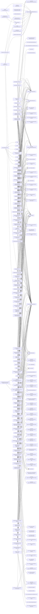

# solid-imager detail 02 - server tests

```mermaid
graph LR
  N0["api/categories/category-id-test.ts"]
  N1["node_modules/vitest/dist/index.js"]
  N2["npm:~/infrastructure/db/schema"]
  N3["api/categories/index.test.ts"]
  N4["api/characters/character-id-test.ts"]
  N5["api/ips/ip-id-test.ts"]
  N6["api/media/add-media.test.ts"]
  N7["npm:@solid-imager/core/domain/media/schemas"]
  N8["node_modules/zod/index.d.cts"]
  N9["api/media/delete-media.test.ts"]
  N10["npm:@solid-imager/core/domain/sources/schemas"]
  N11["api/media/get-media.test.ts"]
  N12["api/media/list-media.test.ts"]
  N13["api/tags/index.test.ts"]
  N14["api/tags/tag-id-test.ts"]
  N15["e2e/app-nav.responsive.spec.ts"]
  N16["node_modules/@playwright/test/index.d.ts"]
  N17["e2e/support/test.ts"]
  N18["e2e/loading-recovery.spec.ts"]
  N19["e2e/media-detail-manager-config.responsive.spec.ts"]
  N20["e2e/realtime-preservation.spec.ts"]
  N21["npm:node:crypto"]
  N22["npm:node:fs/promises"]
  N23["npm:node:path"]
  N24["e2e/route-reload.spec.ts"]
  N25["e2e/search-pro-dialog.responsive.spec.ts"]
  N26["e2e/search-realtime-preservation.responsive.spec.ts"]
  N27["e2e/search.responsive.spec.ts"]
  N28["e2e/support/fixture.ts"]
  N29["e2e/sources-source-media.responsive.spec.ts"]
  N30["e2e/ui-components.gallery.spec.ts"]
  N31["e2e/ui-gallery/index.html"]
  N32["url:ja"]
  N33["url:UTF-8"]
  N34["url:viewport"]
  N35["url:width=device-width, initial-scale=1.0"]
  N36["url:root"]
  N37["url:module"]
  N38["url:src.tsx"]
  N39["e2e/ui-gallery/src.tsx"]
  N40["e2e/ui-gallery/vite.config.ts"]
  N41["npm:node:url"]
  N42["node_modules/@tailwindcss/vite/dist/index.d.mts"]
  N43["node_modules/sharp/dist/index.cjs"]
  N44["node_modules/vite/dist/node/index.js"]
  N45["node_modules/vite-plugin-solid/dist/cjs/index.cjs"]
  N46["e2e/interface-interactions.responsive.spec.ts"]
  N47["e2e/routes.responsive.spec.ts"]
  N48["e2e/scroll-restoration.spec.ts"]
  N49["integration/backup/backup-service.test.ts"]
  N50["node_modules/drizzle-orm/index.d.ts"]
  N51["npm:~/infrastructure/db"]
  N52["integration/backup/performance.test.ts"]
  N53["integration/backup/zip-backup.test.ts"]
  N54["npm:node:fs"]
  N55["npm:node:os"]
  N56["npm:node:stream/promises"]
  N57["integration/db/pglite-parity.test.ts"]
  N58["npm:~/config/database"]
  N59["integration/media/access-denied-integration.test.ts"]
  N60["npm:~/infrastructure/ai/rust-ai-client"]
  N61["npm:~/infrastructure/processing/image-processor"]
  N62["npm:~/infrastructure/repositories/author-repository"]
  N63["npm:~/infrastructure/repositories/character-repository"]
  N64["npm:~/infrastructure/repositories/ip-repository"]
  N65["npm:~/infrastructure/repositories/media-repository"]
  N66["npm:~/infrastructure/repositories/project-repository"]
  N67["npm:~/infrastructure/repositories/source-repository"]
  N68["npm:~/infrastructure/repositories/tag-repository"]
  N69["npm:~/infrastructure/service-registry"]
  N70["npm:~/infrastructure/services/media-service"]
  N71["npm:~/infrastructure/storage/server-media-storage"]
  N72["integration/media/add-media-integration.test.ts"]
  N73["npm:~/infrastructure/db/index"]
  N74["integration/media/copy-media-integration.test.ts"]
  N75["integration/media/delete-media-integration.test.ts"]
  N76["integration/media/get-media-details-integration.test.ts"]
  N77["integration/media/get-media-integration.test.ts"]
  N78["integration/media/list-media-integration.test.ts"]
  N79["integration/media/media-type-handling.test.ts"]
  N80["integration/media/register-media-integration.test.ts"]
  N81["integration/media/update-media-integration.test.ts"]
  N82["integration/queries/search.test.ts"]
  N83["integration/repository/author-dedupe.test.ts"]
  N84["node_modules/drizzle-orm/pglite/migrator.d.ts"]
  N85["integration/repository/character-repository.test.ts"]
  N86["integration/security/backup-security.test.ts"]
  N87["npm:~/infrastructure/services/backup-service"]
  N88["integration/security/path-traversal.test.ts"]
  N89["integration/ai/postgres-ccip-vector-store.test.ts"]
  N90["npm:@solid-imager/application/ports/ccip-vector-store"]
  N91["monorepo-migration.test.ts"]
  N92["setup-integration.ts"]
  N93["node_modules/dotenv/lib/main.d.ts"]
  N94["setup-unit.ts"]
  N95["setup.ts"]
  N96["unit/application/registry.test.ts"]
  N97["unit/application/services/backup-service.test.ts"]
  N98["unit/application/services/character-service.test.ts"]
  N99["unit/application/services/directory-sync-service.test.ts"]
  N100["unit/application/services/media-service.test.ts"]
  N101["npm:@solid-imager/application/services/media-query-service"]
  N102["npm:@solid-imager/application/services/media-transfer-service"]
  N103["npm:@solid-imager/application/services/media-upload-service"]
  N104["apps/server/node_modules/@solid-imager/core/src/index.ts"]
  N105["npm:@solid-imager/core/domain/repositories/author-repository"]
  N106["npm:@solid-imager/core/domain/repositories/character-repository"]
  N107["npm:@solid-imager/core/domain/repositories/ip-repository"]
  N108["npm:@solid-imager/core/domain/repositories/job-repository"]
  N109["npm:@solid-imager/core/domain/repositories/media-repository"]
  N110["npm:@solid-imager/core/domain/repositories/project-repository"]
  N111["npm:@solid-imager/core/domain/repositories/source-repository"]
  N112["npm:@solid-imager/core/domain/repositories/tag-repository"]
  N113["npm:@solid-imager/core/domain/services/image-processor"]
  N114["npm:~/infrastructure/db/transaction-manager"]
  N115["unit/application/services/ccip-vector-service.test.ts"]
  N116["npm:@solid-imager/application/services/ccip-vector-service"]
  N117["unit/application/services/maintenance-service.test.ts"]
  N118["unit/application/services/media-processing-service.test.ts"]
  N119["npm:~/infrastructure/services/media-processing-service"]
  N120["unit/application/services/tagging-service.test.ts"]
  N121["npm:@solid-imager/application/services/tagging-service"]
  N122["npm:@solid-imager/core/domain/interfaces/ai-client"]
  N123["unit/application/services/job-dispatch-service.test.ts"]
  N124["unit/application/services/job-transfer-storage.test.ts"]
  N125["unit/application/services/search-snapshot-service.test.ts"]
  N126["npm:@solid-imager/application/services/search-snapshot-service"]
  N127["npm:@solid-imager/core/domain/errors"]
  N128["npm:@solid-imager/core/domain/repositories/search-snapshot-repository"]
  N129["unit/config/database.test.ts"]
  N130["unit/db/connection.test.ts"]
  N131["unit/domain/media/schemas.test.ts"]
  N132["unit/domain/media/utils/hash-utils.test.ts"]
  N133["apps/server/node_modules/@solid-imager/application/src/index.ts"]
  N134["unit/domain/media/utils/metadata-utils.test.ts"]
  N135["npm:@solid-imager/core/domain/media/utils/metadata-utils"]
  N136["unit/domain/search-mode-transition.test.ts"]
  N137["npm:@solid-imager/core/domain/search/logic"]
  N138["unit/infrastructure/api-clients/ai-api.test.ts"]
  N139["npm:~/infrastructure/api-clients/ai-api"]
  N140["unit/infrastructure/api-clients/downloads-api.test.ts"]
  N141["npm:~/infrastructure/api-clients/downloads-api"]
  N142["unit/infrastructure/api-clients/sources-api-ext.test.ts"]
  N143["unit/infrastructure/file-system/node-file-system.test.ts"]
  N144["npm:~/infrastructure/file-system/node-file-system"]
  N145["unit/infrastructure/jobs/download-jobs.test.ts"]
  N146["npm:~/infrastructure/jobs/download-jobs"]
  N147["unit/infrastructure/jobs/download-rate-limiter.test.ts"]
  N148["unit/infrastructure/jobs/job-worker.test.ts"]
  N149["npm:@solid-imager/core/domain/config/config-schema"]
  N150["npm:~/domain/repositories/job-repository"]
  N151["npm:~/infrastructure/jobs/job-worker"]
  N152["unit/infrastructure/jobs/ccip-jobs.test.ts"]
  N153["unit/infrastructure/jobs/tagging-jobs.test.ts"]
  N154["unit/infrastructure/storage/server-media-storage.test.ts"]
  N155["node_modules/fluent-ffmpeg/index.js"]
  N156["npm:~/infrastructure/processing/bun-image"]
  N157["unit/infrastructure/storage/server-media-storage-formats.test.ts"]
  N158["unit/infrastructure/events/realtime-event-bus.test.ts"]
  N159["npm:@solid-imager/core/domain/sources/events"]
  N160["npm:~/infrastructure/events/realtime-event-bus"]
  N161["unit/infrastructure/api/rpc-response-headers.test.ts"]
  N162["node_modules/@orpc/server/dist/index.d.mts"]
  N163["npm:@orpc/server/fetch"]
  N164["npm:@orpc/server/plugins"]
  N165["npm:~/infrastructure/api/rpc-response-headers"]
  N166["unit/infrastructure/ai/inference-options.test.ts"]
  N167["npm:~/infrastructure/ai/inference-options"]
  N168["unit/infrastructure/processing/image-processor.test.ts"]
  N169["unit/media/copy-media-job.test.ts"]
  N170["npm:~/infrastructure/jobs/thumbnails"]
  N171["unit/security/file-validation.test.ts"]
  N172["unit/server-config-service.test.ts"]
  N173["npm:~/infrastructure/services/server-config-service"]
  N0 --> N1
  N0 --> N2
  N3 --> N1
  N3 --> N2
  N4 --> N1
  N4 --> N2
  N5 --> N1
  N5 --> N2
  N6 --> N7
  N6 --> N1
  N6 --> N8
  N6 --> N2
  N9 --> N7
  N9 --> N10
  N9 --> N1
  N9 --> N8
  N11 --> N7
  N11 --> N10
  N11 --> N1
  N11 --> N8
  N11 --> N2
  N12 --> N7
  N12 --> N10
  N12 --> N1
  N12 --> N8
  N12 --> N2
  N13 --> N1
  N13 --> N2
  N14 --> N1
  N14 --> N2
  N15 --> N16
  N15 --> N17
  N18 --> N16
  N19 --> N16
  N20 --> N21
  N20 --> N22
  N20 --> N23
  N20 --> N16
  N24 --> N16
  N25 --> N17
  N26 --> N21
  N26 --> N22
  N26 --> N23
  N27 --> N16
  N27 --> N28
  N27 --> N17
  N29 --> N16
  N28 --> N23
  N17 --> N16
  N30 --> N16
  N31 --> N32
  N31 --> N33
  N31 --> N34
  N31 --> N35
  N31 --> N36
  N31 --> N37
  N31 --> N38
  N39 --> N7
  N40 --> N23
  N40 --> N41
  N40 --> N42
  N40 --> N43
  N40 --> N44
  N40 --> N45
  N46 --> N16
  N47 --> N16
  N48 --> N16
  N48 --> N28
  N48 --> N17
  N49 --> N22
  N49 --> N50
  N49 --> N1
  N49 --> N51
  N52 --> N50
  N52 --> N1
  N52 --> N51
  N53 --> N54
  N53 --> N22
  N53 --> N55
  N53 --> N23
  N53 --> N56
  N53 --> N50
  N53 --> N1
  N53 --> N51
  N57 --> N54
  N57 --> N23
  N57 --> N1
  N57 --> N58
  N59 --> N1
  N59 --> N60
  N59 --> N61
  N59 --> N62
  N59 --> N63
  N59 --> N64
  N59 --> N65
  N59 --> N66
  N59 --> N67
  N59 --> N68
  N59 --> N69
  N59 --> N70
  N59 --> N71
  N72 --> N50
  N72 --> N1
  N72 --> N73
  N72 --> N2
  N72 --> N65
  N74 --> N50
  N74 --> N1
  N74 --> N73
  N75 --> N50
  N75 --> N1
  N75 --> N8
  N75 --> N60
  N75 --> N73
  N75 --> N2
  N75 --> N61
  N75 --> N62
  N75 --> N63
  N75 --> N64
  N75 --> N65
  N75 --> N66
  N75 --> N67
  N75 --> N68
  N75 --> N69
  N75 --> N70
  N75 --> N71
  N76 --> N22
  N76 --> N23
  N77 --> N1
  N77 --> N8
  N77 --> N60
  N77 --> N73
  N77 --> N2
  N77 --> N61
  N77 --> N62
  N77 --> N63
  N77 --> N64
  N77 --> N65
  N77 --> N66
  N77 --> N67
  N77 --> N68
  N77 --> N69
  N77 --> N70
  N77 --> N71
  N78 --> N1
  N78 --> N8
  N78 --> N60
  N78 --> N73
  N78 --> N2
  N78 --> N61
  N78 --> N62
  N78 --> N63
  N78 --> N64
  N78 --> N65
  N78 --> N66
  N78 --> N67
  N78 --> N68
  N78 --> N69
  N78 --> N70
  N78 --> N71
  N79 --> N22
  N79 --> N23
  N80 --> N22
  N80 --> N23
  N80 --> N1
  N80 --> N73
  N81 --> N50
  N81 --> N1
  N81 --> N8
  N81 --> N60
  N81 --> N73
  N81 --> N2
  N81 --> N61
  N81 --> N62
  N81 --> N63
  N81 --> N64
  N81 --> N65
  N81 --> N66
  N81 --> N67
  N81 --> N68
  N81 --> N69
  N81 --> N70
  N81 --> N71
  N82 --> N1
  N82 --> N51
  N83 --> N50
  N83 --> N84
  N83 --> N1
  N83 --> N51
  N83 --> N2
  N83 --> N62
  N85 --> N50
  N85 --> N84
  N85 --> N1
  N85 --> N51
  N85 --> N2
  N85 --> N63
  N86 --> N1
  N86 --> N87
  N88 --> N22
  N88 --> N23
  N88 --> N1
  N88 --> N71
  N89 --> N23
  N89 --> N90
  N91 --> N54
  N91 --> N23
  N91 --> N1
  N92 --> N23
  N92 --> N93
  N92 --> N1
  N94 --> N23
  N94 --> N93
  N94 --> N1
  N95 --> N23
  N95 --> N93
  N95 --> N1
  N96 --> N1
  N96 --> N69
  N97 --> N7
  N97 --> N1
  N97 --> N51
  N98 --> N1
  N98 --> N69
  N99 --> N1
  N100 --> N101
  N100 --> N102
  N100 --> N103
  N100 --> N104
  N100 --> N7
  N100 --> N105
  N100 --> N106
  N100 --> N107
  N100 --> N108
  N100 --> N109
  N100 --> N110
  N100 --> N111
  N100 --> N112
  N100 --> N113
  N100 --> N1
  N100 --> N114
  N100 --> N70
  N115 --> N116
  N115 --> N1
  N117 --> N22
  N118 --> N1
  N118 --> N119
  N120 --> N121
  N120 --> N122
  N120 --> N106
  N120 --> N107
  N120 --> N109
  N120 --> N111
  N120 --> N112
  N120 --> N1
  N123 --> N1
  N123 --> N2
  N124 --> N21
  N124 --> N22
  N124 --> N55
  N124 --> N23
  N124 --> N108
  N124 --> N1
  N125 --> N126
  N125 --> N127
  N125 --> N128
  N129 --> N54
  N129 --> N23
  N129 --> N1
  N129 --> N58
  N130 --> N1
  N130 --> N58
  N131 --> N7
  N131 --> N1
  N132 --> N21
  N132 --> N54
  N132 --> N55
  N132 --> N23
  N132 --> N133
  N132 --> N1
  N134 --> N135
  N134 --> N1
  N136 --> N7
  N136 --> N137
  N138 --> N1
  N138 --> N139
  N140 --> N1
  N140 --> N141
  N142 --> N1
  N143 --> N22
  N143 --> N55
  N143 --> N23
  N143 --> N1
  N143 --> N144
  N145 --> N1
  N145 --> N146
  N145 --> N65
  N147 --> N1
  N148 --> N149
  N148 --> N1
  N148 --> N150
  N148 --> N2
  N148 --> N151
  N152 --> N1
  N152 --> N150
  N153 --> N1
  N153 --> N150
  N154 --> N22
  N154 --> N155
  N154 --> N1
  N154 --> N156
  N154 --> N71
  N157 --> N22
  N157 --> N55
  N157 --> N23
  N157 --> N43
  N157 --> N1
  N157 --> N71
  N158 --> N159
  N158 --> N1
  N158 --> N160
  N161 --> N162
  N161 --> N163
  N161 --> N164
  N161 --> N1
  N161 --> N8
  N161 --> N165
  N166 --> N1
  N166 --> N167
  N168 --> N22
  N168 --> N55
  N168 --> N23
  N168 --> N43
  N168 --> N1
  N168 --> N61
  N169 --> N1
  N169 --> N170
  N169 --> N65
  N169 --> N69
  N169 --> N70
  N171 --> N1
  N171 --> N70
  N172 --> N54
  N172 --> N22
  N172 --> N149
  N172 --> N1
  N172 --> N173
```
