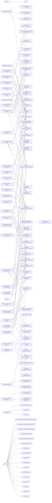

# solid-imager detail 04 - server components and root modules

```mermaid
graph LR
  N0["app.css"]
  N1["url:"]
  N2["components/layout/layout.tsx"]
  N3["npm:@solid-imager/ui/router-status"]
  N4["node_modules/@tanstack/solid-router/dist/cjs/index.cjs"]
  N5["npm:~/components/api-activity-indicator"]
  N6["components/layout/app-shell.tsx"]
  N7["components/layout/mobile-header.tsx"]
  N8["npm:@solid-imager/ui/button"]
  N9["npm:@solid-imager/ui/workspace/icons"]
  N10["npm:~/components/imports/pending-downloads-indicator"]
  N11["components/layout/sidebar.tsx"]
  N12["npm:@solid-imager/core/domain/sources/schemas"]
  N13["npm:@solid-imager/ui/shortcuts/index"]
  N14["components/layout/source-list.tsx"]
  N15["components/pages/about-page.tsx"]
  N16["npm:@solid-imager/ui/badge"]
  N17["components/pages/config-page.tsx"]
  N18["npm:@solid-imager/ui/query-options"]
  N19["npm:@solid-imager/ui/query-state"]
  N20["npm:@solid-imager/ui/screens/config-state-screen"]
  N21["node_modules/@tanstack/solid-query/build/index.cjs"]
  N22["npm:~/infrastructure/api-clients/orpc-client"]
  N23["npm:~/infrastructure/api-clients/queries"]
  N24["components/pages/jobs-page.tsx"]
  N25["npm:@solid-imager/core/domain/jobs/schemas"]
  N26["npm:@solid-imager/ui/hooks/use-job-events"]
  N27["components/pages/manager-page.tsx"]
  N28["npm:@solid-imager/ui/hooks/use-manager-page"]
  N29["npm:@solid-imager/ui/screens/manager/types"]
  N30["npm:@solid-imager/ui/screens/manager-screen"]
  N31["npm:@solid-imager/ui/toast"]
  N32["npm:~/hooks/use-batch-job-events"]
  N33["components/pages/media-detail-page.tsx"]
  N34["npm:@solid-imager/core/domain/media/schemas"]
  N35["npm:@solid-imager/ui/screens/media-detail-screen"]
  N36["components/pages/search-content.tsx"]
  N37["npm:@solid-imager/core/utils"]
  N38["components/imports/pending-downloads-indicator.tsx"]
  N39["npm:@solid-imager/ui/pending-downloads-indicator"]
  N40["components/imports/pending-downloads-indicator-data.ts"]
  N41["npm:@solid-imager/ui/event-stream"]
  N42["components/media/ai-tagging-modal.tsx"]
  N43["npm:@solid-imager/ui/ai-tagging-modal"]
  N44["npm:~/infrastructure/api-clients/ai-api"]
  N45["components/media/association-manager.tsx"]
  N46["components/media/bulk-action-dialog.tsx"]
  N47["components/media/character-crop-modal.tsx"]
  N48["npm:@solid-imager/ui/character-crop-modal"]
  N49["components/media/search-filters.tsx"]
  N50["npm:@solid-imager/core/domain/authors/schemas"]
  N51["npm:@solid-imager/core/domain/characters/schemas"]
  N52["npm:@solid-imager/core/domain/ips/schemas"]
  N53["npm:@solid-imager/core/domain/projects/schemas"]
  N54["npm:@solid-imager/core/domain/tags/schemas"]
  N55["components/media/media-actions.tsx"]
  N56["components/media/media-grid-item.tsx"]
  N57["components/media/media-viewer.tsx"]
  N58["components/media/move-copy-media-dialog.tsx"]
  N59["npm:@solid-imager/ui/move-copy-media-dialog"]
  N60["node_modules/solid-js/types/index.d.ts"]
  N61["npm:~/infrastructure/api-clients/sources-api"]
  N62["components/media/preset-manager.tsx"]
  N63["npm:@solid-imager/ui/preset-client"]
  N64["npm:@solid-imager/ui/preset-manager"]
  N65["npm:~/infrastructure/api/clients/preset-client"]
  N66["components/media/pro-search-builder.tsx"]
  N67["components/media/pro-search-dialog.tsx"]
  N68["components/media/search-control-panel.tsx"]
  N69["npm:@solid-imager/ui/label"]
  N70["components/media/media-sidebar.tsx"]
  N71["components/media/sort-controls.tsx"]
  N72["components/media/thumbnail-image.tsx"]
  N73["npm:@solid-imager/ui/thumbnail-image"]
  N74["components/media/oppai-oracle-modal.tsx"]
  N75["npm:@solid-imager/ui/oppai-oracle-modal"]
  N76["components/media/media-context.ts"]
  N77["components/simple-modal.tsx"]
  N78["components/api-activity-indicator.tsx"]
  N79["components/not-found.tsx"]
  N80["components/swagger-ui.tsx"]
  N81["node_modules/swagger-ui-dist/swagger-ui-bundle.js"]
  N82["node_modules/swagger-ui-dist/swagger-ui.css"]
  N83["components/upload-media-modal.tsx"]
  N84["npm:@solid-imager/ui/upload-media-modal-content"]
  N85["npm:~/infrastructure/api-clients/fetch-url-api"]
  N86["components/route-compat.tsx"]
  N87["npm:@solid-imager/ui/route-compat"]
  N88["npm:~/components/not-found"]
  N89["config/database.ts"]
  N90["npm:node:fs"]
  N91["npm:node:path"]
  N92["node_modules/zod/index.d.cts"]
  N93["router.tsx"]
  N94["apps/server/node_modules/@solid-imager/client/src/index.ts"]
  N95["routeTree.gen.ts"]
  N96["routes/__root.tsx"]
  N97["routes/index.tsx"]
  N98["routes/$.tsx"]
  N99["routes/about.tsx"]
  N100["routes/config.tsx"]
  N101["routes/design-lab.tsx"]
  N102["routes/jobs.tsx"]
  N103["routes/manager.tsx"]
  N104["routes/search.tsx"]
  N105["routes/sources/index.tsx"]
  N106["routes/api/rpc.$.ts"]
  N107["routes/docs/swagger/index.tsx"]
  N108["routes/sources/$mediaSourceId/index.tsx"]
  N109["routes/api/jobs.$jobId.artifact.ts"]
  N110["routes/api/sources.$mediaSourceId.$mediaId.ts"]
  N111["routes/sources/$mediaSourceId/$mediaId/index.tsx"]
  N112["routes/api/sources.$mediaSourceId.thumbnail.$mediaId.ts"]
  N0 --> N1
  N2 --> N3
  N2 --> N4
  N2 --> N5
  N2 --> N6
  N7 --> N8
  N7 --> N9
  N7 --> N10
  N11 --> N12
  N11 --> N8
  N11 --> N13
  N14 --> N12
  N14 --> N8
  N15 --> N16
  N15 --> N8
  N17 --> N18
  N17 --> N19
  N17 --> N20
  N17 --> N21
  N17 --> N22
  N17 --> N23
  N24 --> N25
  N24 --> N26
  N27 --> N28
  N27 --> N18
  N27 --> N29
  N27 --> N30
  N27 --> N31
  N27 --> N21
  N27 --> N32
  N33 --> N34
  N33 --> N8
  N33 --> N35
  N36 --> N34
  N36 --> N37
  N36 --> N8
  N38 --> N39
  N38 --> N40
  N40 --> N41
  N42 --> N43
  N42 --> N44
  N45 --> N16
  N45 --> N8
  N46 --> N12
  N46 --> N8
  N47 --> N34
  N47 --> N48
  N47 --> N44
  N49 --> N50
  N49 --> N51
  N49 --> N52
  N49 --> N34
  N49 --> N53
  N49 --> N54
  N49 --> N16
  N49 --> N8
  N55 --> N34
  N55 --> N37
  N56 --> N34
  N57 --> N34
  N58 --> N12
  N58 --> N59
  N58 --> N60
  N58 --> N61
  N62 --> N63
  N62 --> N64
  N62 --> N65
  N66 --> N50
  N66 --> N51
  N66 --> N52
  N67 --> N50
  N67 --> N51
  N67 --> N52
  N67 --> N34
  N67 --> N53
  N67 --> N54
  N67 --> N8
  N68 --> N50
  N68 --> N51
  N68 --> N52
  N68 --> N53
  N68 --> N12
  N68 --> N54
  N68 --> N8
  N68 --> N69
  N70 --> N34
  N70 --> N37
  N71 --> N69
  N72 --> N34
  N72 --> N73
  N74 --> N75
  N74 --> N44
  N76 --> N34
  N77 --> N8
  N77 --> N60
  N78 --> N21
  N79 --> N8
  N79 --> N9
  N79 --> N4
  N80 --> N60
  N80 --> N81
  N80 --> N82
  N83 --> N84
  N83 --> N85
  N86 --> N87
  N86 --> N4
  N86 --> N60
  N86 --> N88
  N89 --> N90
  N89 --> N91
  N89 --> N92
  N93 --> N94
  N93 --> N18
  N95 --> N96
  N95 --> N97
  N95 --> N98
  N95 --> N99
  N95 --> N100
  N95 --> N101
  N95 --> N102
  N95 --> N103
  N95 --> N104
  N95 --> N105
  N95 --> N106
  N95 --> N107
  N95 --> N108
  N95 --> N109
  N95 --> N110
  N95 --> N111
  N95 --> N112
```
