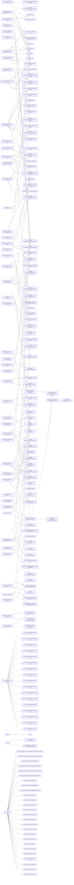

# solid-imager detail 04 - server application and components

```mermaid
graph LR
  N0["application/services/author-service.ts"];
  N1["npm:@solid-imager/application/services/author-service"];
  N2["npm:~/infrastructure/repositories/author-repository"];
  N3["application/services/backup-service.ts"];
  N4["npm:node:fs"];
  N5["npm:node:fs/promises"];
  N6["npm:node:path"];
  N7["npm:node:stream"];
  N8["npm:node:stream/promises"];
  N9["application/services/bulk-operation-service.ts"];
  N10["npm:@solid-imager/core/domain/media/schemas"];
  N11["npm:~/application/registry"];
  N12["npm:~/infrastructure/jobs/thumbnails"];
  N13["npm:~/infrastructure/logger"];
  N14["application/services/category-service.ts"];
  N15["npm:@solid-imager/application/services/category-service"];
  N16["npm:~/infrastructure/repositories/category-repository"];
  N17["application/services/collection-service.ts"];
  N18["npm:@solid-imager/application/services/collection-service"];
  N19["npm:~/infrastructure/repositories/collection-repository"];
  N20["application/services/directory-service.ts"];
  N21["npm:~/application/services/media-source-service"];
  N22["npm:~/infrastructure/storage/factory"];
  N23["application/services/directory-sync-service.ts"];
  N24["npm:@solid-imager/core/domain/sources/schemas"];
  N25["npm:~/application/services/ccip-vector-service"];
  N26["npm:~/application/services/media-processing-service"];
  N27["npm:~/infrastructure/events/realtime-event-bus"];
  N28["npm:~/infrastructure/repositories/media-repository"];
  N29["npm:~/infrastructure/repositories/source-repository"];
  N30["application/services/ip-service.ts"];
  N31["npm:@solid-imager/application/services/ip-service"];
  N32["npm:~/infrastructure/repositories/ip-repository"];
  N33["application/services/job-dispatch-service.ts"];
  N34["npm:@solid-imager/application/ports/media-service"];
  N35["npm:@solid-imager/core/domain/repositories/job-repository"];
  N36["application/services/job-transfer-storage.ts"];
  N37["npm:~/infrastructure/utils/stream-utils"];
  N38["application/services/maintenance-service.ts"];
  N39["npm:@solid-imager/core/domain/repositories/media-repository"];
  N40["npm:@solid-imager/core/domain/repositories/source-repository"];
  N41["npm:~/domain/repositories/job-repository"];
  N42["application/services/media-processing-service.ts"];
  N43["npm:@solid-imager/core/domain/interfaces/transaction-manager"];
  N44["application/services/preset-service.ts"];
  N45["apps/server/node_modules/@solid-imager/application/src/index.ts"];
  N46["npm:@solid-imager/application/services/preset-service"];
  N47["npm:@solid-imager/core/domain/repositories/preset-repository"];
  N48["npm:~/infrastructure/repositories/preset-repository"];
  N49["application/services/project-service.ts"];
  N50["npm:@solid-imager/application/services/project-service"];
  N51["npm:~/infrastructure/repositories/project-repository"];
  N52["application/services/search-service.ts"];
  N53["npm:@solid-imager/application/services/search-service"];
  N54["application/services/server-config-service.ts"];
  N55["npm:node:util"];
  N56["apps/server/node_modules/@solid-imager/core/src/index.ts"];
  N57["application/services/tag-service.ts"];
  N58["npm:@solid-imager/application/services/tag-service"];
  N59["npm:~/infrastructure/repositories/tag-repository"];
  N60["application/services/tagging-service.ts"];
  N61["npm:@solid-imager/application/services/tagging-service"];
  N62["application/services/thumbnail-service.ts"];
  N63["npm:@solid-imager/core/domain/thumbnails/schemas"];
  N64["application/services/user-service.ts"];
  N65["npm:@solid-imager/application/services/user-service"];
  N66["npm:~/infrastructure/repositories/user-repository"];
  N67["application/services/ccip-vector-service.ts"];
  N68["npm:@solid-imager/application/services/ccip-vector-service"];
  N69["npm:~/application/services/tagging-service"];
  N70["npm:~/infrastructure/ai/postgres-ccip-vector-store"];
  N71["npm:~/infrastructure/db"];
  N72["application/services/source-transfer-job-service.ts"];
  N73["components/imports/pending-downloads-indicator.tsx"];
  N74["npm:@solid-imager/ui/pending-downloads-indicator"];
  N75["components/imports/pending-downloads-indicator-data.ts"];
  N76["npm:@solid-imager/ui/event-stream"];
  N77["components/imports/v2-pending-downloads-indicator.tsx"];
  N78["npm:@solid-imager/ui/v2-pending-downloads-indicator"];
  N79["components/media/ai-tagging-modal.tsx"];
  N80["npm:@solid-imager/ui/ai-tagging-modal"];
  N81["npm:~/infrastructure/api-clients/ai-api"];
  N82["components/media/association-manager.tsx"];
  N83["npm:@solid-imager/ui/badge"];
  N84["npm:@solid-imager/ui/button"];
  N85["components/media/bulk-action-dialog.tsx"];
  N86["components/media/character-crop-modal.tsx"];
  N87["npm:@solid-imager/ui/character-crop-modal"];
  N88["components/media/search-filters.tsx"];
  N89["npm:@solid-imager/core/domain/authors/schemas"];
  N90["npm:@solid-imager/core/domain/characters/schemas"];
  N91["npm:@solid-imager/core/domain/ips/schemas"];
  N92["npm:@solid-imager/core/domain/projects/schemas"];
  N93["npm:@solid-imager/core/domain/tags/schemas"];
  N94["components/media/media-viewer.tsx"];
  N95["components/media/move-copy-media-dialog.tsx"];
  N96["npm:@solid-imager/ui/move-copy-media-dialog"];
  N97["apps/server/node_modules/solid-js/types/index.d.ts"];
  N98["npm:~/infrastructure/api-clients/sources-api"];
  N99["components/media/preset-manager.tsx"];
  N100["npm:@solid-imager/ui/preset-client"];
  N101["npm:@solid-imager/ui/preset-manager"];
  N102["npm:~/infrastructure/api/clients/preset-client"];
  N103["components/media/pro-search-builder.tsx"];
  N104["components/media/pro-search-dialog.tsx"];
  N105["components/media/search-control-panel.tsx"];
  N106["npm:@solid-imager/ui/label"];
  N107["components/media/sort-controls.tsx"];
  N108["components/media/thumbnail-image.tsx"];
  N109["npm:@solid-imager/ui/thumbnail-image"];
  N110["components/media/oppai-oracle-modal.tsx"];
  N111["npm:@solid-imager/ui/oppai-oracle-modal"];
  N112["components/media/legacy-media-grid-item.tsx"];
  N113["components/media/legacy-media-sidebar.tsx"];
  N114["npm:@solid-imager/core/utils"];
  N115["npm:@solid-imager/ui/clipboard-copy"];
  N116["npm:@solid-imager/ui/collapsible"];
  N117["npm:@solid-imager/ui/stores/search-store"];
  N118["npm:@solid-imager/ui/toast"];
  N119["apps/server/node_modules/@tanstack/solid-query/build/index.cjs"];
  N120["apps/server/node_modules/@tanstack/solid-router/dist/cjs/index.cjs"];
  N121["components/media/v2-media-actions.tsx"];
  N122["components/media/v2-media-sidebar.tsx"];
  N123["components/media/v2-media-viewer.tsx"];
  N124["components/nav.tsx"];
  N125["npm:@solid-imager/ui/layouts/app-nav"];
  N126["components/simple-modal.tsx"];
  N127["components/swagger-ui.tsx"];
  N128["apps/server/node_modules/swagger-ui-dist/swagger-ui-bundle.js"];
  N129["apps/server/node_modules/swagger-ui-dist/swagger-ui.css"];
  N130["components/upload-media-modal.tsx"];
  N131["npm:@solid-imager/ui/legacy-upload-media-modal-content"];
  N132["npm:~/infrastructure/api-clients/fetch-url-api"];
  N133["components/api-activity-indicator.tsx"];
  N134["components/v2-upload-media-modal.tsx"];
  N135["npm:@solid-imager/ui/v2-upload-media-modal-content"];
  N136["components/v2/v2-mobile-header.tsx"];
  N137["npm:@solid-imager/ui/v2/icons"];
  N138["npm:~/components/imports/v2-pending-downloads-indicator"];
  N139["components/v2/v2-sidebar.tsx"];
  N140["components/v2/v2-source-list.tsx"];
  N141["config/database.ts"];
  N142["apps/server/node_modules/zod/index.d.cts"];
  N143["domain/shared/api-contract.ts"];
  N144["npm:~/infrastructure/api/routers/ai-router"];
  N145["npm:~/infrastructure/api/routers/authors-router"];
  N146["npm:~/infrastructure/api/routers/categories-router"];
  N147["npm:~/infrastructure/api/routers/characters-router"];
  N148["npm:~/infrastructure/api/routers/config-router"];
  N149["npm:~/infrastructure/api/routers/directories-router"];
  N150["npm:~/infrastructure/api/routers/downloads-router"];
  N151["npm:~/infrastructure/api/routers/imports-router"];
  N152["npm:~/infrastructure/api/routers/ips-router"];
  N153["npm:~/infrastructure/api/routers/jobs-router"];
  N154["npm:~/infrastructure/api/routers/media-router"];
  N155["npm:~/infrastructure/api/routers/presets-router"];
  N156["npm:~/infrastructure/api/routers/projects-router"];
  N157["npm:~/infrastructure/api/routers/sources-router"];
  N158["npm:~/infrastructure/api/routers/tags-router"];
  N159["npm:~/infrastructure/api/routers/thumbnails-router"];
  N160["npm:~/infrastructure/api/routers/utils-router"];
  N161["app.css"];
  N162["url:"];
  N163["router.tsx"];
  N164["apps/server/node_modules/@solid-imager/client/src/index.ts"];
  N165["npm:@solid-imager/ui/query-options"];
  N166["routeTree.gen.ts"];
  N167["apps/server/src/routes/__root.tsx"];
  N168["apps/server/src/routes/search.tsx"];
  N169["apps/server/src/routes/manager.tsx"];
  N170["apps/server/src/routes/design-lab.tsx"];
  N171["apps/server/src/routes/config.tsx"];
  N172["apps/server/src/routes/about.tsx"];
  N173["apps/server/src/routes/$.tsx"];
  N174["apps/server/src/routes/v2/route.tsx"];
  N175["apps/server/src/routes/index.tsx"];
  N176["apps/server/src/routes/v2/index.tsx"];
  N177["apps/server/src/routes/sources/index.tsx"];
  N178["apps/server/src/routes/v2/search.tsx"];
  N179["apps/server/src/routes/v2/manager.tsx"];
  N180["apps/server/src/routes/v2/jobs.tsx"];
  N181["apps/server/src/routes/v2/config.tsx"];
  N182["apps/server/src/routes/v2/about.tsx"];
  N183["apps/server/src/routes/v2/$.tsx"];
  N184["apps/server/src/routes/sources/$mediaSourceId/index.tsx"];
  N185["apps/server/src/routes/docs/swagger/index.tsx"];
  N186["apps/server/src/routes/api/rpc.$.ts"];
  N187["apps/server/src/routes/v2/sources/$mediaSourceId/index.tsx"];
  N188["apps/server/src/routes/sources/$mediaSourceId/$mediaId/index.tsx"];
  N189["apps/server/src/routes/api/sources.$mediaSourceId.$mediaId.ts"];
  N190["apps/server/src/routes/api/jobs.$jobId.artifact.ts"];
  N191["apps/server/src/routes/v2/sources/$mediaSourceId/$mediaId/index.tsx"];
  N192["apps/server/src/routes/api/sources.$mediaSourceId.thumbnail.$mediaId.ts"];
  N0 --> N1;
  N0 --> N2;
  N3 --> N4;
  N3 --> N5;
  N3 --> N6;
  N3 --> N7;
  N3 --> N8;
  N9 --> N10;
  N9 --> N11;
  N9 --> N12;
  N9 --> N13;
  N14 --> N15;
  N14 --> N16;
  N17 --> N18;
  N17 --> N19;
  N20 --> N21;
  N20 --> N22;
  N23 --> N5;
  N23 --> N6;
  N23 --> N24;
  N23 --> N11;
  N23 --> N25;
  N23 --> N26;
  N23 --> N27;
  N23 --> N12;
  N23 --> N13;
  N23 --> N28;
  N23 --> N29;
  N30 --> N31;
  N30 --> N32;
  N33 --> N34;
  N33 --> N35;
  N33 --> N11;
  N36 --> N4;
  N36 --> N5;
  N36 --> N6;
  N36 --> N8;
  N36 --> N35;
  N36 --> N37;
  N38 --> N5;
  N38 --> N6;
  N38 --> N39;
  N38 --> N40;
  N38 --> N41;
  N38 --> N12;
  N38 --> N13;
  N42 --> N43;
  N42 --> N10;
  N42 --> N35;
  N42 --> N11;
  N44 --> N45;
  N44 --> N46;
  N44 --> N47;
  N44 --> N48;
  N49 --> N50;
  N49 --> N51;
  N52 --> N53;
  N52 --> N11;
  N54 --> N4;
  N54 --> N5;
  N54 --> N6;
  N54 --> N55;
  N54 --> N56;
  N57 --> N58;
  N57 --> N59;
  N60 --> N61;
  N60 --> N11;
  N60 --> N27;
  N60 --> N13;
  N62 --> N63;
  N62 --> N11;
  N64 --> N65;
  N64 --> N66;
  N67 --> N34;
  N67 --> N68;
  N67 --> N11;
  N67 --> N69;
  N67 --> N70;
  N67 --> N71;
  N72 --> N4;
  N72 --> N5;
  N72 --> N6;
  N72 --> N8;
  N73 --> N74;
  N73 --> N75;
  N75 --> N76;
  N77 --> N78;
  N77 --> N75;
  N79 --> N80;
  N79 --> N81;
  N82 --> N83;
  N82 --> N84;
  N85 --> N24;
  N85 --> N84;
  N86 --> N10;
  N86 --> N87;
  N86 --> N81;
  N88 --> N89;
  N88 --> N90;
  N88 --> N91;
  N88 --> N92;
  N88 --> N93;
  N88 --> N83;
  N88 --> N84;
  N94 --> N10;
  N95 --> N24;
  N95 --> N96;
  N95 --> N97;
  N95 --> N98;
  N99 --> N100;
  N99 --> N101;
  N99 --> N102;
  N103 --> N89;
  N103 --> N90;
  N103 --> N91;
  N104 --> N89;
  N104 --> N90;
  N104 --> N91;
  N104 --> N10;
  N104 --> N92;
  N104 --> N93;
  N104 --> N84;
  N105 --> N89;
  N105 --> N90;
  N105 --> N91;
  N105 --> N92;
  N105 --> N24;
  N105 --> N93;
  N105 --> N84;
  N105 --> N106;
  N107 --> N106;
  N108 --> N10;
  N108 --> N109;
  N110 --> N111;
  N110 --> N81;
  N112 --> N10;
  N113 --> N10;
  N113 --> N114;
  N113 --> N83;
  N113 --> N115;
  N113 --> N116;
  N113 --> N117;
  N113 --> N118;
  N113 --> N119;
  N113 --> N120;
  N121 --> N10;
  N121 --> N114;
  N121 --> N84;
  N122 --> N10;
  N122 --> N114;
  N123 --> N10;
  N124 --> N125;
  N124 --> N73;
  N126 --> N84;
  N126 --> N97;
  N127 --> N97;
  N127 --> N128;
  N127 --> N129;
  N130 --> N131;
  N130 --> N132;
  N133 --> N119;
  N134 --> N135;
  N134 --> N132;
  N136 --> N84;
  N136 --> N137;
  N136 --> N138;
  N139 --> N24;
  N139 --> N84;
  N140 --> N24;
  N140 --> N84;
  N141 --> N4;
  N141 --> N6;
  N141 --> N142;
  N143 --> N144;
  N143 --> N145;
  N143 --> N146;
  N143 --> N147;
  N143 --> N148;
  N143 --> N149;
  N143 --> N150;
  N143 --> N151;
  N143 --> N152;
  N143 --> N153;
  N143 --> N154;
  N143 --> N155;
  N143 --> N156;
  N143 --> N157;
  N143 --> N158;
  N143 --> N159;
  N143 --> N160;
  N161 --> N162;
  N163 --> N164;
  N163 --> N165;
  N166 --> N167;
  N166 --> N168;
  N166 --> N169;
  N166 --> N170;
  N166 --> N171;
  N166 --> N172;
  N166 --> N173;
  N166 --> N174;
  N166 --> N175;
  N166 --> N176;
  N166 --> N177;
  N166 --> N178;
  N166 --> N179;
  N166 --> N180;
  N166 --> N181;
  N166 --> N182;
  N166 --> N183;
  N166 --> N184;
  N166 --> N185;
  N166 --> N186;
  N166 --> N187;
  N166 --> N188;
  N166 --> N189;
  N166 --> N190;
  N166 --> N191;
  N166 --> N192;
```