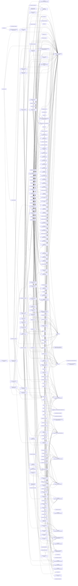

# solid-imager detail 05 - ui

```mermaid
graph LR
  N0["ai-tagging-modal.tsx"];
  N1["npm:@solid-imager/core/domain/tagging/schemas"];
  N2["packages/ui/node_modules/solid-js/types/index.d.ts"];
  N3["badge.tsx"];
  N4["association-manager.tsx"];
  N5["npm:@solid-imager/core/utils"];
  N6["button.tsx"];
  N7["packages/ui/node_modules/class-variance-authority/dist/index.d.ts"];
  N8["utils/cn.ts"];
  N9["card.tsx"];
  N10["character-crop-modal.tsx"];
  N11["npm:@solid-imager/core/domain/media/schemas"];
  N12["checkbox.tsx"];
  N13["clipboard-copy.tsx"];
  N14["toast.tsx"];
  N15["collapsible.tsx"];
  N16["packages/ui/node_modules/@kobalte/core/dist/index.d.ts"];
  N17["combobox.tsx"];
  N18["npm:@kobalte/core/combobox"];
  N19["npm:@kobalte/core/polymorphic"];
  N20["packages/ui/node_modules/@tanstack/solid-virtual/dist/cjs/index.cjs"];
  N21["command.tsx"];
  N22["npm:@kobalte/core/dialog"];
  N23["packages/ui/node_modules/cmdk-solid/dist/index.cjs"];
  N24["counter.tsx"];
  N25["dummy.test.ts"];
  N26["packages/ui/node_modules/vitest/dist/index.js"];
  N27["hooks/use-manager-page.ts"];
  N28["npm:@solid-imager/core/domain/characters/schemas"];
  N29["npm:@solid-imager/core/domain/ips/schemas"];
  N30["npm:@solid-imager/core/domain/projects/schemas"];
  N31["hooks/use-search-page.ts"];
  N32["hooks/use-source-media-page.test.ts"];
  N33["hooks/restore-import.ts"];
  N34["hooks/use-source-media-page.ts"];
  N35["npm:@solid-imager/core/domain/jobs/schemas"];
  N36["hooks/use-source-root-path.test.ts"];
  N37["hooks/use-source-root-path.ts"];
  N38["npm:@solid-imager/core/domain/sources/schemas"];
  N39["packages/ui/node_modules/@tanstack/solid-query/build/index.cjs"];
  N40["hooks/use-batch-job-events.test.ts"];
  N41["npm:@solid-imager/core/domain/sources/events"];
  N42["hooks/use-current-search-persistence.test.ts"];
  N43["hooks/scroll-container.ts"];
  N44["packages/ui/node_modules/solid-js/web/types/index.d.ts"];
  N45["hooks/use-job-events.ts"];
  N46["event-stream.ts"];
  N47["import-inbox-helpers.ts"];
  N48["input.tsx"];
  N49["label.tsx"];
  N50["layouts/app-shell.tsx"];
  N51["media-card-item.tsx"];
  N52["media-grid-item.tsx"];
  N53["media-list-actions.tsx"];
  N54["packages/ui/node_modules/@tanstack/solid-router/dist/cjs/index.cjs"];
  N55["media-sidebar-content.tsx"];
  N56["media-sidebar.tsx"];
  N57["move-copy-media-dialog.tsx"];
  N58["pagination-controls.tsx"];
  N59["pending-downloads-indicator.tsx"];
  N60["import-review-modal.tsx"];
  N61["pending-downloads-indicator.types.ts"];
  N62["pending-downloads-indicator-core.tsx"];
  N63["popover.tsx"];
  N64["npm:@kobalte/core/popover"];
  N65["pro-search-builder.tsx"];
  N66["npm:@solid-imager/core/domain/authors/schemas"];
  N67["pro-search-dialog.tsx"];
  N68["npm:@solid-imager/core/domain/tags/schemas"];
  N69["query-options/authors-query.ts"];
  N70["query-options/characters-query.ts"];
  N71["query-options/config-query.ts"];
  N72["npm:@solid-imager/core/domain/config/config-schema"];
  N73["query-options/ips-query.ts"];
  N74["query-options/media-query.ts"];
  N75["npm:@solid-imager/core/domain/shared/schemas"];
  N76["query-options/projects-query.ts"];
  N77["query-options/sources-query.ts"];
  N78["query-options/tags-query.ts"];
  N79["query-options/prefetch.ts"];
  N80["query-options/query-client.test.ts"];
  N81["query-options/query-client.ts"];
  N82["screens/config-screen.tsx"];
  N83["packages/ui/node_modules/@tanstack/solid-form/dist/cjs/index.cjs"];
  N84["packages/ui/node_modules/zod/index.d.cts"];
  N85["screens/manager-screen.tsx"];
  N86["screens/not-found-screen.tsx"];
  N87["screens/search-screen.tsx"];
  N88["async-state.tsx"];
  N89["mobile-search-filter-dialog.tsx"];
  N90["search-control-panel.tsx"];
  N91["skeleton.tsx"];
  N92["source-media-grid.tsx"];
  N93["screens/search-screen.types.ts"];
  N94["screens/source-media-screen.tsx"];
  N95["screens/config-state-screen.types.ts"];
  N96["query-state.ts"];
  N97["screens/design-concept-screen.tsx"];
  N98["npm:lucide-solid/icons/arrow-down-up"];
  N99["npm:lucide-solid/icons/arrow-left"];
  N100["npm:lucide-solid/icons/ban"];
  N101["npm:lucide-solid/icons/bot"];
  N102["npm:lucide-solid/icons/briefcase-business"];
  N103["npm:lucide-solid/icons/chevron-down"];
  N104["npm:lucide-solid/icons/chevron-left"];
  N105["npm:lucide-solid/icons/chevron-right"];
  N106["npm:lucide-solid/icons/circle-alert"];
  N107["npm:lucide-solid/icons/circle-check"];
  N108["npm:lucide-solid/icons/clock-3"];
  N109["npm:lucide-solid/icons/cloud-download"];
  N110["npm:lucide-solid/icons/database"];
  N111["npm:lucide-solid/icons/download"];
  N112["npm:lucide-solid/icons/external-link"];
  N113["npm:lucide-solid/icons/filter"];
  N114["npm:lucide-solid/icons/folder"];
  N115["npm:lucide-solid/icons/grid-3-x-3"];
  N116["npm:lucide-solid/icons/hard-drive"];
  N117["npm:lucide-solid/icons/image"];
  N118["npm:lucide-solid/icons/inbox"];
  N119["npm:lucide-solid/icons/library"];
  N120["npm:lucide-solid/icons/list"];
  N121["npm:lucide-solid/icons/logs"];
  N122["npm:lucide-solid/icons/panel-left-close"];
  N123["npm:lucide-solid/icons/panel-left-open"];
  N124["npm:lucide-solid/icons/panels-top-left"];
  N125["npm:lucide-solid/icons/plus"];
  N126["npm:lucide-solid/icons/refresh-cw"];
  N127["npm:lucide-solid/icons/rotate-ccw"];
  N128["npm:lucide-solid/icons/search"];
  N129["npm:lucide-solid/icons/settings"];
  N130["npm:lucide-solid/icons/share-2"];
  N131["npm:lucide-solid/icons/trash-2"];
  N132["npm:lucide-solid/icons/x"];
  N133["screens/legacy-config-state-screen.tsx"];
  N134["screens/legacy-media-detail-screen.tsx"];
  N135["legacy-media-detail-skeleton.tsx"];
  N136["screens/media-detail-screen.types.ts"];
  N137["screens/media-detail-screen-core.tsx"];
  N138["screens/source-media-screen.types.ts"];
  N139["screens/v2-config-screen.tsx"];
  N140["screens/v2-config-state-screen.tsx"];
  N141["v2/management-layout.tsx"];
  N142["screens/v2-manager-screen.tsx"];
  N143["screens/v2-manager/batch-tools.tsx"];
  N144["screens/v2-manager/job-status.tsx"];
  N145["screens/v2-manager/source-select.tsx"];
  N146["screens/v2-manager/data-transfer.tsx"];
  N147["npm:lucide-solid/icons/upload"];
  N148["screens/v2-manager/dialogs.tsx"];
  N149["screens/v2-manager/duplicates.tsx"];
  N150["screens/v2-manager/entity-panel.tsx"];
  N151["npm:lucide-solid/icons/pencil"];
  N152["progress.tsx"];
  N153["screens/v2-manager/navigation.tsx"];
  N154["npm:lucide-solid/icons/copy-check"];
  N155["screens/v2-manager/thumbnail.tsx"];
  N156["screens/v2-manager/types.ts"];
  N157["screens/v2-manager/utils.test.ts"];
  N158["screens/v2-manager/utils.ts"];
  N159["screens/v2-media-detail-screen.tsx"];
  N160["v2-media-detail-skeleton.tsx"];
  N161["screens/v2-search-screen.tsx"];
  N162["screens/v2-source-media-screen.tsx"];
  N163["npm:@solid-imager/core/domain/search/logic"];
  N164["npm:@solid-imager/core/domain/search/schema"];
  N165["packages/ui/node_modules/solid-js/store/types/index.d.ts"];
  N166["preset-manager.tsx"];
  N167["search-filters.tsx"];
  N168["select.tsx"];
  N169["sort-controls.tsx"];
  N170["source-delete-modal.tsx"];
  N171["source-media-page.tsx"];
  N172["stores/search-store.ts"];
  N173["stores/search-store.test.ts"];
  N174["switch.tsx"];
  N175["tabs.tsx"];
  N176["textarea.tsx"];
  N177["thumbnail-image.tsx"];
  N178["thumbnail-source.ts"];
  N179["packages/ui/node_modules/clsx/dist/clsx.js"];
  N180["packages/ui/node_modules/tailwind-merge/dist/types.d.ts"];
  N181["utils/debounce.ts"];
  N182["event-stream.test.ts"];
  N183["form-message.tsx"];
  N184["form-schemas.test.ts"];
  N185["form-schemas.ts"];
  N186["oppai-oracle-modal.tsx"];
  N187["query-state.test.ts"];
  N188["router-status.tsx"];
  N189["screen-skeleton.tsx"];
  N190["text-field.tsx"];
  N191["npm:@kobalte/core/text-field"];
  N192["import-review-modal.types.ts"];
  N193["legacy-import-review-modal.tsx"];
  N194["legacy-upload-media-modal.tsx"];
  N195["media-preview-selection.test.ts"];
  N196["media-preview-selection.ts"];
  N197["v2/collection-inspector.tsx"];
  N198["v2/icons.tsx"];
  N199["v2/search-composer-utils.ts"];
  N200["v2/search-composer.test.ts"];
  N201["v2/search-composer.tsx"];
  N202["v2/search-toolbar.tsx"];
  N203["thumbnail-source.test.ts"];
  N204["v2-import-review-modal.tsx"];
  N205["v2-media-grid-item.tsx"];
  N206["v2-pending-downloads-indicator.tsx"];
  N207["v2-upload-media-modal-content.tsx"];
  N208["upload-media-modal-content.types.ts"];
  N209["v2-upload-media-modal.tsx"];
  N0 --> N1;
  N0 --> N2;
  N0 --> N3;
  N4 --> N5;
  N4 --> N2;
  N4 --> N3;
  N4 --> N6;
  N3 --> N7;
  N3 --> N2;
  N3 --> N8;
  N9 --> N2;
  N9 --> N8;
  N10 --> N11;
  N10 --> N1;
  N10 --> N2;
  N10 --> N12;
  N13 --> N2;
  N13 --> N14;
  N13 --> N8;
  N15 --> N16;
  N17 --> N18;
  N17 --> N19;
  N17 --> N20;
  N17 --> N2;
  N21 --> N22;
  N21 --> N23;
  N24 --> N2;
  N25 --> N26;
  N27 --> N28;
  N27 --> N29;
  N27 --> N11;
  N27 --> N30;
  N31 --> N28;
  N31 --> N29;
  N32 --> N26;
  N32 --> N33;
  N34 --> N28;
  N34 --> N29;
  N34 --> N35;
  N36 --> N26;
  N36 --> N37;
  N37 --> N38;
  N37 --> N39;
  N40 --> N41;
  N40 --> N26;
  N42 --> N2;
  N42 --> N26;
  N43 --> N2;
  N43 --> N44;
  N45 --> N41;
  N45 --> N2;
  N45 --> N44;
  N45 --> N46;
  N47 --> N11;
  N47 --> N38;
  N48 --> N2;
  N48 --> N8;
  N49 --> N2;
  N49 --> N8;
  N50 --> N2;
  N51 --> N11;
  N51 --> N2;
  N51 --> N9;
  N51 --> N12;
  N51 --> N8;
  N52 --> N11;
  N52 --> N2;
  N52 --> N8;
  N53 --> N54;
  N53 --> N2;
  N53 --> N44;
  N53 --> N6;
  N55 --> N28;
  N55 --> N29;
  N55 --> N11;
  N55 --> N30;
  N56 --> N28;
  N56 --> N29;
  N56 --> N11;
  N56 --> N30;
  N57 --> N2;
  N57 --> N6;
  N58 --> N6;
  N59 --> N2;
  N59 --> N60;
  N59 --> N61;
  N59 --> N62;
  N63 --> N19;
  N63 --> N64;
  N63 --> N2;
  N63 --> N8;
  N65 --> N66;
  N65 --> N28;
  N65 --> N29;
  N67 --> N66;
  N67 --> N28;
  N67 --> N29;
  N67 --> N11;
  N67 --> N30;
  N67 --> N68;
  N67 --> N2;
  N67 --> N6;
  N69 --> N66;
  N69 --> N39;
  N70 --> N28;
  N70 --> N39;
  N71 --> N72;
  N71 --> N39;
  N73 --> N29;
  N73 --> N39;
  N74 --> N11;
  N74 --> N75;
  N74 --> N39;
  N76 --> N30;
  N76 --> N39;
  N77 --> N38;
  N77 --> N39;
  N78 --> N68;
  N78 --> N39;
  N79 --> N44;
  N80 --> N39;
  N80 --> N26;
  N81 --> N39;
  N82 --> N72;
  N82 --> N83;
  N82 --> N2;
  N82 --> N84;
  N82 --> N6;
  N85 --> N29;
  N85 --> N11;
  N85 --> N2;
  N86 --> N54;
  N87 --> N54;
  N87 --> N2;
  N87 --> N88;
  N87 --> N9;
  N87 --> N89;
  N87 --> N90;
  N87 --> N91;
  N87 --> N92;
  N87 --> N93;
  N94 --> N54;
  N94 --> N2;
  N94 --> N88;
  N94 --> N6;
  N94 --> N9;
  N95 --> N72;
  N95 --> N96;
  N97 --> N98;
  N97 --> N99;
  N97 --> N100;
  N97 --> N101;
  N97 --> N102;
  N97 --> N103;
  N97 --> N104;
  N97 --> N105;
  N97 --> N106;
  N97 --> N107;
  N97 --> N108;
  N97 --> N109;
  N97 --> N110;
  N97 --> N111;
  N97 --> N112;
  N97 --> N113;
  N97 --> N114;
  N97 --> N115;
  N97 --> N116;
  N97 --> N117;
  N97 --> N118;
  N97 --> N119;
  N97 --> N120;
  N97 --> N121;
  N97 --> N122;
  N97 --> N123;
  N97 --> N124;
  N97 --> N125;
  N97 --> N126;
  N97 --> N127;
  N97 --> N128;
  N97 --> N129;
  N97 --> N130;
  N97 --> N131;
  N97 --> N132;
  N133 --> N2;
  N133 --> N88;
  N133 --> N91;
  N133 --> N8;
  N133 --> N82;
  N133 --> N95;
  N134 --> N135;
  N134 --> N91;
  N134 --> N136;
  N134 --> N137;
  N137 --> N11;
  N136 --> N11;
  N93 --> N11;
  N93 --> N38;
  N138 --> N11;
  N138 --> N2;
  N139 --> N72;
  N139 --> N1;
  N139 --> N83;
  N139 --> N54;
  N139 --> N101;
  N139 --> N102;
  N139 --> N109;
  N139 --> N116;
  N139 --> N117;
  N139 --> N121;
  N139 --> N2;
  N139 --> N84;
  N140 --> N1;
  N140 --> N2;
  N140 --> N88;
  N140 --> N91;
  N140 --> N8;
  N140 --> N141;
  N140 --> N95;
  N140 --> N139;
  N142 --> N2;
  N143 --> N2;
  N143 --> N6;
  N143 --> N12;
  N143 --> N27;
  N143 --> N49;
  N143 --> N144;
  N143 --> N145;
  N146 --> N111;
  N146 --> N147;
  N146 --> N2;
  N146 --> N6;
  N146 --> N12;
  N146 --> N27;
  N146 --> N48;
  N146 --> N49;
  N148 --> N29;
  N148 --> N2;
  N149 --> N2;
  N149 --> N6;
  N149 --> N27;
  N149 --> N49;
  N150 --> N151;
  N150 --> N125;
  N150 --> N128;
  N150 --> N131;
  N150 --> N2;
  N150 --> N88;
  N150 --> N6;
  N144 --> N2;
  N144 --> N3;
  N144 --> N27;
  N144 --> N152;
  N153 --> N101;
  N153 --> N154;
  N153 --> N114;
  N153 --> N117;
  N153 --> N130;
  N153 --> N2;
  N153 --> N6;
  N145 --> N27;
  N155 --> N2;
  N155 --> N6;
  N155 --> N27;
  N155 --> N49;
  N155 --> N144;
  N155 --> N145;
  N156 --> N27;
  N157 --> N26;
  N157 --> N158;
  N158 --> N28;
  N158 --> N29;
  N159 --> N91;
  N159 --> N160;
  N159 --> N136;
  N159 --> N137;
  N161 --> N11;
  N161 --> N2;
  N161 --> N88;
  N161 --> N91;
  N162 --> N147;
  N162 --> N2;
  N162 --> N88;
  N162 --> N6;
  N90 --> N66;
  N90 --> N28;
  N90 --> N29;
  N90 --> N30;
  N90 --> N163;
  N90 --> N164;
  N90 --> N38;
  N90 --> N68;
  N90 --> N2;
  N90 --> N165;
  N90 --> N6;
  N90 --> N49;
  N90 --> N166;
  N90 --> N67;
  N90 --> N167;
  N167 --> N66;
  N167 --> N28;
  N167 --> N29;
  N167 --> N30;
  N167 --> N164;
  N167 --> N68;
  N167 --> N2;
  N167 --> N165;
  N167 --> N3;
  N167 --> N6;
  N168 --> N19;
  N169 --> N49;
  N170 --> N6;
  N92 --> N11;
  N171 --> N28;
  N171 --> N29;
  N172 --> N11;
  N173 --> N26;
  N174 --> N16;
  N175 --> N16;
  N176 --> N2;
  N176 --> N8;
  N177 --> N2;
  N178 --> N11;
  N178 --> N2;
  N178 --> N177;
  N14 --> N2;
  N14 --> N44;
  N8 --> N179;
  N8 --> N180;
  N181 --> N2;
  N88 --> N2;
  N88 --> N44;
  N88 --> N6;
  N88 --> N96;
  N88 --> N8;
  N182 --> N26;
  N182 --> N46;
  N183 --> N2;
  N183 --> N8;
  N184 --> N26;
  N185 --> N84;
  N186 --> N1;
  N186 --> N2;
  N186 --> N3;
  N187 --> N26;
  N187 --> N96;
  N188 --> N54;
  N188 --> N2;
  N188 --> N88;
  N188 --> N189;
  N189 --> N2;
  N189 --> N135;
  N91 --> N2;
  N91 --> N9;
  N91 --> N8;
  N190 --> N16;
  N190 --> N191;
  N190 --> N7;
  N190 --> N2;
  N190 --> N8;
  N192 --> N11;
  N192 --> N38;
  N193 --> N5;
  N135 --> N91;
  N135 --> N8;
  N194 --> N5;
  N194 --> N83;
  N194 --> N2;
  N194 --> N84;
  N194 --> N6;
  N195 --> N26;
  N195 --> N196;
  N197 --> N11;
  N197 --> N2;
  N197 --> N6;
  N198 --> N2;
  N141 --> N2;
  N199 --> N31;
  N200 --> N26;
  N200 --> N31;
  N201 --> N128;
  N201 --> N2;
  N202 --> N164;
  N202 --> N38;
  N202 --> N98;
  N202 --> N103;
  N202 --> N113;
  N202 --> N115;
  N202 --> N120;
  N202 --> N2;
  N62 --> N5;
  N61 --> N41;
  N61 --> N38;
  N61 --> N192;
  N203 --> N2;
  N203 --> N26;
  N204 --> N5;
  N160 --> N91;
  N160 --> N8;
  N205 --> N11;
  N205 --> N2;
  N205 --> N8;
  N206 --> N2;
  N206 --> N61;
  N206 --> N62;
  N206 --> N8;
  N206 --> N204;
  N207 --> N208;
  N209 --> N5;
  N209 --> N83;
  N209 --> N2;
  N209 --> N84;
```