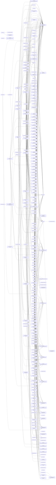

# solid-imager detail 05 - UI

## Diagram 1

```mermaid
graph LR
  N0["ai-tagging-modal.tsx"]
  N1["npm:@solid-imager/core/domain/tagging/schemas"]
  N2["node_modules/solid-js/types/index.d.ts"]
  N3["badge.tsx"]
  N4["association-manager.tsx"]
  N5["npm:@solid-imager/core/utils"]
  N6["button.tsx"]
  N7["node_modules/class-variance-authority/dist/index.d.ts"]
  N8["utils/cn.ts"]
  N9["card.tsx"]
  N10["character-crop-modal.tsx"]
  N11["npm:@solid-imager/core/domain/media/schemas"]
  N12["checkbox.tsx"]
  N13["clipboard-copy.tsx"]
  N14["toast.tsx"]
  N15["collapsible.tsx"]
  N16["node_modules/@kobalte/core/dist/index.d.ts"]
  N17["combobox.tsx"]
  N18["npm:@kobalte/core/combobox"]
  N19["npm:@kobalte/core/polymorphic"]
  N20["node_modules/@tanstack/solid-virtual/dist/cjs/index.cjs"]
  N21["command.tsx"]
  N22["npm:@kobalte/core/dialog"]
  N23["node_modules/cmdk-solid/dist/index.cjs"]
  N24["counter.tsx"]
  N25["dummy.test.ts"]
  N26["node_modules/vitest/dist/index.js"]
  N27["hooks/use-manager-page.ts"]
  N28["npm:@solid-imager/core/domain/characters/schemas"]
  N29["npm:@solid-imager/core/domain/ips/schemas"]
  N30["npm:@solid-imager/core/domain/projects/schemas"]
  N31["hooks/use-search-page.ts"]
  N32["hooks/use-source-media-page.test.ts"]
  N33["hooks/restore-import.ts"]
  N34["hooks/use-source-media-page.ts"]
  N35["hooks/use-source-root-path.test.ts"]
  N36["hooks/use-source-root-path.ts"]
  N37["npm:@solid-imager/core/domain/sources/schemas"]
  N38["node_modules/@tanstack/solid-query/build/index.cjs"]
  N39["hooks/use-batch-job-events.test.ts"]
  N40["npm:@solid-imager/core/domain/sources/events"]
  N41["hooks/use-current-search-persistence.test.ts"]
  N42["hooks/scroll-container.ts"]
  N43["node_modules/solid-js/web/types/index.d.ts"]
  N44["hooks/use-job-events.ts"]
  N45["event-stream.ts"]
  N46["hooks/use-media-collection-selection.test.ts"]
  N47["hooks/use-media-collection-selection.ts"]
  N48["hooks/stable-media-results.ts"]
  N49["node_modules/solid-js/store/types/index.d.ts"]
  N50["import-inbox-helpers.ts"]
  N51["input.tsx"]
  N52["label.tsx"]
  N53["layouts/app-shell.tsx"]
  N54["layouts/command-center.tsx"]
  N55["node_modules/@tanstack/solid-router/dist/cjs/index.cjs"]
  N56["layouts/mobile-header.tsx"]
  N57["workspace/icons.tsx"]
  N58["layouts/navigation.tsx"]
  N59["layouts/sidebar.tsx"]
  N60["shortcuts/index.ts"]
  N61["layouts/source-list.tsx"]
  N62["media-card-item.tsx"]
  N63["import-review-modal.tsx"]
  N64["media-context.ts"]
  N65["media-context.test.ts"]
  N66["media-sidebar.tsx"]
  N67["move-copy-media-dialog.tsx"]
  N68["pagination-controls.tsx"]
  N69["upload-media-modal.tsx"]
  N70["node_modules/@tanstack/solid-form/dist/cjs/index.cjs"]
  N71["node_modules/zod/index.d.cts"]
  N72["popover.tsx"]
  N73["npm:@kobalte/core/popover"]
  N74["preset-client.ts"]
  N75["npm:@solid-imager/core/domain/contract/presets-client"]
  N76["pro-search-builder.tsx"]
  N77["npm:@solid-imager/core/domain/authors/schemas"]
  N78["pro-search-dialog.tsx"]
  N79["npm:@solid-imager/core/domain/tags/schemas"]
  N80["query-options/authors-query.ts"]
  N81["query-options/characters-query.ts"]
  N82["query-options/config-query.ts"]
  N83["npm:@solid-imager/core/domain/config/config-schema"]
  N84["query-options/ips-query.ts"]
  N85["query-options/media-query.ts"]
  N86["npm:@solid-imager/core/domain/shared/schemas"]
  N87["query-options/projects-query.ts"]
  N88["query-options/sources-query.ts"]
  N89["query-options/tags-query.ts"]
  N90["query-options/prefetch.ts"]
  N91["query-options/query-client.test.ts"]
  N92["query-options/query-client.ts"]
  N93["query-options/jobs-query.test.ts"]
  N94["npm:@solid-imager/core/domain/jobs/schemas"]
  N95["query-options/jobs-query.ts"]
  N96["screens/config-screen.tsx"]
  N97["npm:lucide-solid/icons/bot"]
  N98["npm:lucide-solid/icons/briefcase-business"]
  N99["npm:lucide-solid/icons/cloud-download"]
  N100["npm:lucide-solid/icons/hard-drive"]
  N101["npm:lucide-solid/icons/image"]
  N102["npm:lucide-solid/icons/keyboard"]
  N103["npm:lucide-solid/icons/logs"]
  N104["screens/config-state-screen.tsx"]
  N105["async-state.tsx"]
  N106["skeleton.tsx"]
  N107["workspace/management-layout.tsx"]
  N108["screens/config-state-screen.types.ts"]
  N109["screens/media-detail-screen.tsx"]
  N110["media-detail-skeleton.tsx"]
  N111["screens/media-detail-screen.types.ts"]
  N112["screens/media-detail-screen-core.tsx"]
  N113["screens/not-found-screen.tsx"]
  N114["screens/manager-screen.tsx"]
  N115["screens/search-screen.tsx"]
  N116["screens/source-media-screen.tsx"]
  N117["npm:lucide-solid/icons/upload"]
  N118["query-state.ts"]
  N119["screens/design-concept-screen.tsx"]
  N120["npm:lucide-solid/icons/arrow-down-up"]
  N121["npm:lucide-solid/icons/arrow-left"]
  N122["npm:lucide-solid/icons/ban"]
  N123["npm:lucide-solid/icons/chevron-down"]
  N124["npm:lucide-solid/icons/chevron-left"]
  N125["npm:lucide-solid/icons/chevron-right"]
  N126["npm:lucide-solid/icons/circle-alert"]
  N127["npm:lucide-solid/icons/circle-check"]
  N128["npm:lucide-solid/icons/clock-3"]
  N129["npm:lucide-solid/icons/database"]
  N130["npm:lucide-solid/icons/download"]
  N131["npm:lucide-solid/icons/external-link"]
  N132["npm:lucide-solid/icons/filter"]
  N133["npm:lucide-solid/icons/folder"]
  N134["npm:lucide-solid/icons/grid-3-x-3"]
  N135["npm:lucide-solid/icons/inbox"]
  N136["npm:lucide-solid/icons/library"]
  N137["npm:lucide-solid/icons/list"]
  N138["npm:lucide-solid/icons/panel-left-close"]
  N139["npm:lucide-solid/icons/panel-left-open"]
  N140["npm:lucide-solid/icons/panels-top-left"]
  N141["npm:lucide-solid/icons/plus"]
  N142["npm:lucide-solid/icons/refresh-cw"]
  N143["npm:lucide-solid/icons/rotate-ccw"]
  N144["npm:lucide-solid/icons/search"]
  N145["npm:lucide-solid/icons/settings"]
  N146["npm:lucide-solid/icons/share-2"]
  N147["npm:lucide-solid/icons/trash-2"]
  N148["npm:lucide-solid/icons/x"]
  N149["screens/about-screen.tsx"]
  N150["screens/search-screen.types.ts"]
  N151["screens/source-media-screen.types.ts"]
  N152["screens/jobs-selection.test.ts"]
  N153["screens/jobs-selection.ts"]
  N154["screens/manager/batch-tools.tsx"]
  N155["screens/manager/job-status.tsx"]
  N156["screens/manager/source-select.tsx"]
  N157["screens/manager/data-transfer.tsx"]
  N158["screens/manager/dialogs.tsx"]
  N159["screens/manager/duplicates.tsx"]
  N160["screens/manager/entity-panel.tsx"]
  N161["npm:lucide-solid/icons/pencil"]
  N162["progress.tsx"]
  N163["screens/manager/navigation.tsx"]
  N164["npm:lucide-solid/icons/copy-check"]
  N165["screens/manager/thumbnail.tsx"]
  N166["screens/manager/types.ts"]
  N167["screens/manager/utils.test.ts"]
  N168["screens/manager/utils.ts"]
  N169["search-control-panel.tsx"]
  N170["npm:@solid-imager/core/domain/search/logic"]
  N171["npm:@solid-imager/core/domain/search/schema"]
  N172["preset-manager.tsx"]
  N173["search-filters.tsx"]
  N174["select.tsx"]
  N175["sort-controls.tsx"]
  N176["source-delete-modal.tsx"]
  N177["media-grid-item.tsx"]
  N178["source-media-grid.tsx"]
  N179["source-media-page.tsx"]
  N180["stores/search-store.ts"]
  N181["stores/search-store.test.ts"]
  N182["switch.tsx"]
  N183["tabs.tsx"]
  N184["textarea.tsx"]
  N185["thumbnail-image.tsx"]
  N186["thumbnail-source.ts"]
  N187["node_modules/clsx/dist/clsx.js"]
  N188["node_modules/tailwind-merge/dist/types.d.ts"]
  N189["utils/debounce.ts"]
  N190["event-stream.test.ts"]
  N191["form-message.tsx"]
  N192["form-schemas.test.ts"]
  N193["form-schemas.ts"]
  N194["oppai-oracle-modal.tsx"]
  N195["query-state.test.ts"]
  N196["router-status.tsx"]
  N197["screen-skeleton.tsx"]
  N198["text-field.tsx"]
  N199["npm:@kobalte/core/text-field"]
  N200["import-review-modal.types.ts"]
  N201["ui-storage.test.ts"]
  N202["media-grid-item-link.tsx"]
  N203["media-actions.tsx"]
  N204["bulk-action-dialog.tsx"]
  N205["media-sidebar-content.tsx"]
  N206["media-preview-selection.test.ts"]
  N207["media-preview-selection.ts"]
  N208["pending-downloads-indicator-core.tsx"]
  N209["pending-downloads-indicator.types.ts"]
  N210["thumbnail-source.test.ts"]
  N211["pending-downloads-indicator.tsx"]
  N212["route-compat.test.ts"]
  N213["route-compat.ts"]
  N214["workspace/collection-inspector.tsx"]
  N215["workspace/collection-navigation.test.ts"]
  N216["workspace/search-composer-utils.ts"]
  N217["workspace/search-composer.test.ts"]
  N218["workspace/search-composer.tsx"]
  N219["workspace/search-toolbar.tsx"]
  N220["shortcuts/create-app-shortcut.ts"]
  N221["search-history-client.ts"]
  N222["npm:@solid-imager/core/domain/contract/search-snapshots-client"]
  N223["search-history-route.ts"]
  N224["shortcuts/definitions.ts"]
  N225["node_modules/@tanstack/solid-hotkeys/dist/index.js"]
  N226["shortcuts/preferences-provider.tsx"]
  N227["shortcuts/preferences-storage.test.ts"]
  N228["shortcuts/shortcut-kbd.tsx"]
  N229["shortcuts/preferences-storage.ts"]
  N230["import-source-preference.ts"]
  N231["media-detail-header.tsx"]
  N0 --> N1
  N0 --> N2
  N0 --> N3
  N4 --> N5
  N4 --> N2
  N4 --> N3
  N4 --> N6
  N3 --> N7
  N3 --> N2
  N3 --> N8
  N9 --> N2
  N9 --> N8
  N10 --> N11
  N10 --> N1
  N10 --> N2
  N10 --> N12
  N13 --> N2
  N13 --> N14
  N13 --> N8
  N15 --> N16
  N17 --> N18
  N17 --> N19
  N17 --> N20
  N17 --> N2
  N21 --> N22
  N21 --> N23
  N24 --> N2
  N25 --> N26
  N27 --> N28
  N27 --> N29
  N27 --> N11
  N27 --> N30
  N31 --> N28
  N31 --> N29
  N32 --> N26
  N32 --> N33
  N34 --> N28
  N34 --> N29
  N35 --> N26
  N35 --> N36
  N36 --> N37
  N36 --> N38
  N39 --> N40
  N39 --> N26
  N41 --> N2
  N41 --> N26
  N42 --> N2
  N42 --> N43
  N44 --> N40
  N44 --> N2
  N44 --> N43
  N44 --> N45
  N46 --> N26
  N47 --> N2
  N48 --> N11
  N48 --> N38
  N48 --> N2
  N48 --> N49
  N50 --> N11
  N50 --> N37
  N51 --> N2
  N51 --> N8
  N52 --> N2
  N52 --> N8
  N53 --> N37
  N53 --> N2
  N54 --> N55
  N56 --> N2
  N56 --> N6
  N56 --> N57
  N58 --> N55
  N58 --> N2
  N59 --> N37
  N59 --> N55
  N59 --> N2
  N59 --> N6
  N59 --> N60
  N61 --> N37
  N61 --> N55
  N61 --> N2
  N61 --> N6
  N62 --> N11
  N62 --> N2
  N62 --> N9
  N62 --> N12
  N62 --> N8
  N63 --> N5
  N64 --> N11
  N65 --> N26
  N66 --> N28
  N66 --> N29
  N66 --> N11
  N66 --> N30
  N66 --> N5
  N66 --> N55
  N67 --> N2
  N67 --> N6
  N68 --> N6
  N69 --> N5
  N69 --> N70
  N69 --> N2
  N69 --> N71
  N72 --> N19
  N72 --> N73
  N72 --> N2
  N72 --> N8
  N74 --> N75
  N76 --> N77
  N76 --> N28
  N76 --> N29
  N78 --> N77
  N78 --> N28
  N78 --> N29
  N78 --> N11
  N78 --> N30
  N78 --> N79
  N78 --> N2
  N78 --> N6
  N80 --> N77
  N80 --> N38
  N81 --> N28
  N81 --> N38
  N82 --> N83
  N82 --> N38
  N84 --> N29
  N84 --> N38
  N85 --> N11
  N85 --> N86
  N85 --> N38
  N87 --> N30
  N87 --> N38
  N88 --> N37
  N88 --> N38
  N89 --> N79
  N89 --> N38
  N90 --> N43
  N91 --> N38
  N91 --> N26
  N92 --> N38
  N93 --> N94
  N93 --> N26
  N93 --> N95
  N96 --> N83
  N96 --> N1
  N96 --> N70
  N96 --> N55
  N96 --> N97
  N96 --> N98
  N96 --> N99
  N96 --> N100
  N96 --> N101
  N96 --> N102
  N96 --> N103
  N96 --> N2
  N96 --> N71
  N104 --> N1
  N104 --> N2
  N104 --> N105
  N104 --> N106
  N104 --> N8
  N104 --> N107
  N104 --> N96
  N104 --> N108
  N109 --> N110
  N109 --> N106
  N109 --> N111
  N109 --> N112
  N113 --> N55
  N114 --> N2
  N115 --> N11
  N115 --> N2
  N115 --> N105
  N115 --> N6
  N115 --> N47
  N115 --> N106
  N116 --> N117
  N116 --> N2
  N116 --> N105
  N116 --> N6
  N108 --> N83
  N108 --> N118
  N119 --> N120
  N119 --> N121
  N119 --> N122
  N119 --> N97
  N119 --> N98
  N119 --> N123
  N119 --> N124
  N119 --> N125
  N119 --> N126
  N119 --> N127
  N119 --> N128
  N119 --> N99
  N119 --> N129
  N119 --> N130
  N119 --> N131
  N119 --> N132
  N119 --> N133
  N119 --> N134
  N119 --> N100
  N119 --> N101
  N119 --> N135
  N119 --> N136
  N119 --> N137
  N119 --> N103
  N119 --> N138
  N119 --> N139
  N119 --> N140
  N119 --> N141
  N119 --> N142
  N119 --> N143
  N119 --> N144
  N119 --> N145
  N119 --> N146
  N119 --> N147
  N119 --> N148
  N149 --> N3
  N149 --> N6
  N149 --> N9
  N112 --> N11
  N111 --> N11
  N150 --> N11
  N150 --> N37
  N151 --> N11
  N151 --> N2
  N151 --> N47
  N152 --> N94
  N152 --> N26
  N153 --> N94
  N154 --> N2
  N154 --> N6
  N154 --> N12
  N154 --> N27
  N154 --> N52
  N154 --> N155
  N154 --> N156
  N157 --> N130
  N157 --> N117
  N157 --> N2
  N157 --> N6
  N157 --> N12
  N157 --> N27
  N157 --> N51
  N157 --> N52
  N158 --> N29
  N158 --> N2
  N159 --> N2
  N159 --> N6
  N159 --> N27
  N159 --> N52
  N160 --> N161
  N160 --> N141
  N160 --> N144
  N160 --> N147
  N160 --> N2
  N160 --> N105
  N160 --> N6
  N155 --> N2
  N155 --> N3
  N155 --> N27
  N155 --> N162
  N163 --> N97
  N163 --> N164
  N163 --> N133
  N163 --> N101
  N163 --> N146
  N163 --> N2
  N163 --> N6
  N156 --> N27
  N165 --> N2
  N165 --> N6
  N165 --> N27
  N165 --> N52
  N165 --> N155
  N165 --> N156
  N166 --> N27
  N167 --> N26
  N167 --> N168
  N168 --> N28
  N168 --> N29
  N169 --> N77
  N169 --> N28
  N169 --> N29
  N169 --> N30
  N169 --> N170
  N169 --> N171
  N169 --> N37
  N169 --> N79
  N169 --> N2
  N169 --> N49
  N169 --> N6
  N169 --> N52
  N169 --> N172
  N169 --> N78
  N169 --> N173
  N173 --> N77
  N173 --> N28
  N173 --> N29
  N173 --> N30
  N173 --> N171
  N173 --> N79
  N173 --> N2
  N173 --> N49
  N173 --> N3
  N173 --> N6
  N174 --> N19
  N175 --> N11
  N175 --> N2
  N175 --> N6
  N175 --> N51
  N175 --> N52
  N176 --> N6
  N177 --> N11
  N177 --> N2
  N177 --> N8
  N178 --> N11
  N179 --> N28
  N179 --> N29
  N180 --> N11
  N181 --> N26
  N182 --> N16
  N183 --> N16
  N184 --> N2
  N184 --> N8
  N185 --> N2
  N186 --> N11
  N186 --> N2
  N186 --> N185
  N14 --> N2
  N14 --> N43
  N8 --> N187
  N8 --> N188
  N189 --> N2
  N105 --> N2
  N105 --> N43
  N105 --> N6
  N105 --> N118
  N105 --> N8
  N190 --> N26
  N190 --> N45
  N191 --> N2
  N191 --> N8
  N192 --> N26
  N193 --> N71
  N194 --> N1
  N194 --> N2
  N194 --> N3
  N195 --> N26
  N195 --> N118
  N196 --> N55
  N196 --> N2
  N196 --> N105
  N196 --> N197
  N197 --> N2
  N197 --> N110
  N106 --> N2
  N106 --> N9
  N106 --> N8
  N198 --> N16
  N198 --> N199
  N198 --> N7
  N198 --> N2
  N198 --> N8
  N200 --> N11
  N200 --> N37
  N201 --> N26
  N202 --> N11
  N202 --> N55
  N202 --> N2
  N202 --> N177
  N203 --> N11
  N204 --> N37
  N204 --> N2
  N204 --> N6
  N205 --> N28
  N205 --> N29
  N205 --> N11
  N205 --> N30
  N206 --> N26
  N206 --> N207
  N208 --> N5
  N209 --> N40
  N209 --> N37
  N209 --> N200
  N210 --> N2
  N210 --> N26
  N211 --> N2
  N211 --> N63
  N211 --> N209
  N211 --> N208
  N211 --> N8
  N110 --> N106
  N110 --> N8
  N212 --> N26
  N212 --> N213
  N214 --> N11
  N214 --> N131
  N214 --> N148
  N214 --> N2
  N214 --> N6
  N215 --> N26
  N57 --> N2
  N107 --> N2
  N216 --> N11
  N216 --> N171
  N216 --> N31
  N217 --> N171
  N217 --> N26
  N217 --> N31
  N218 --> N144
  N218 --> N2
  N219 --> N171
  N219 --> N37
  N219 --> N120
  N219 --> N123
  N219 --> N132
  N219 --> N134
  N219 --> N137
  N219 --> N2
  N219 --> N6
  N219 --> N72
  N219 --> N169
  N219 --> N220
  N219 --> N175
  N219 --> N178
  N221 --> N222
  N223 --> N71
  N224 --> N225
  N226 --> N225
  N227 --> N26
  N227 --> N224
  N228 --> N225
  N228 --> N2
  N228 --> N8
  N228 --> N224
  N228 --> N226
  N228 --> N229
  N230 --> N37
  N231 --> N11
  N231 --> N55
  N231 --> N2
  N231 --> N6
```
