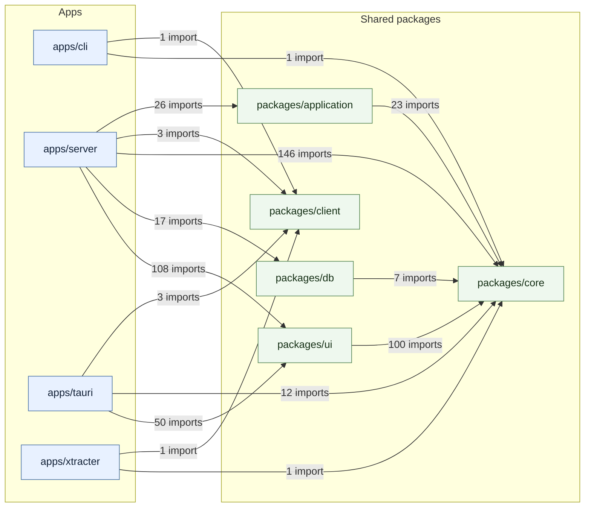

# solid-imager package dependencies

The edge labels are cross-package import counts from the scoped indexion graph; package-local and external dependency edges are omitted.

```mermaid
flowchart LR
  %% Aggregated from indexion's source dependency graph.
  %% Scope: apps/{cli,server,tauri,xtracter}/src and packages/{application,client,core,db,ui}/src.
  %% Edge labels are the number of import edges detected by indexion.

  subgraph apps["Apps"]
    cli["apps/cli"]
    server["apps/server"]
    tauri["apps/tauri"]
    xtracter["apps/xtracter"]
  end

  subgraph packages["Shared packages"]
    application["packages/application"]
    client["packages/client"]
    core["packages/core"]
    db["packages/db"]
    ui["packages/ui"]
  end

  cli -->|1 import| client
  cli -->|1 import| core

  server -->|26 imports| application
  server -->|3 imports| client
  server -->|146 imports| core
  server -->|17 imports| db
  server -->|108 imports| ui

  tauri -->|3 imports| client
  tauri -->|12 imports| core
  tauri -->|50 imports| ui

  xtracter -->|1 import| client
  xtracter -->|1 import| core

  application -->|23 imports| core
  db -->|7 imports| core
  ui -->|100 imports| core

  classDef app fill:#e8f1ff,stroke:#4f76a8,color:#132238;
  classDef pkg fill:#eef8ee,stroke:#5b8a5a,color:#173117;
  class cli,server,tauri,xtracter app;
  class application,client,core,db,ui pkg;
```
