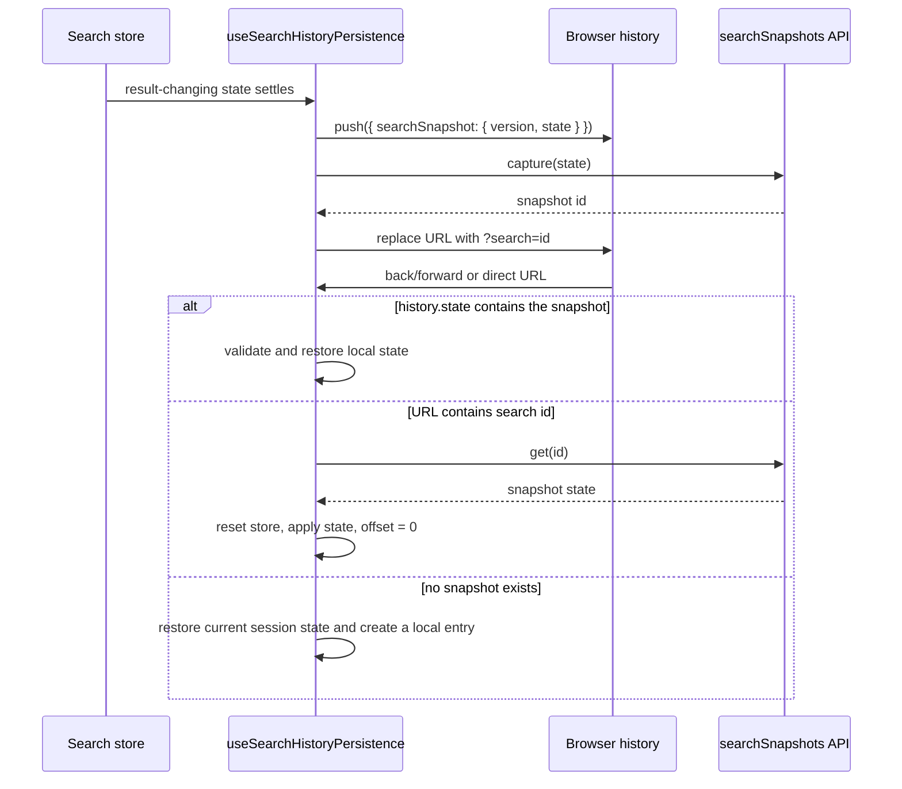

# Search history and browser navigation

検索結果は検索ストアの現在値だけでなく、ブラウザの履歴エントリごとに復元できる状態として扱う。これにより、検索 → 詳細画面 → 戻る／進むという遷移でも、各検索結果を同じ画面に再表示できる。

## 保存する状態

`SearchSnapshotState` は `packages/core/src/domain/search/schema.ts` の `searchStateSchema` から、結果を決めない UI ローカル値を除いたスナップショットである。

- 除外: `activePresetId`, `offset`, `scrollY`
- 含む: mode、検索語、タグ／エンティティの絞り込み、類似検索の anchor と topK、limit、sort
- 履歴 state: `history.state.searchSnapshot = { version: 1, id?, state }`
- URL: サーバーに保存されたスナップショットは `?search=<uuid>` で参照する

スクロール位置は検索条件とは別に、ルーターが提供する履歴エントリキーを含めて保存する。したがって、同じ検索条件を別の履歴エントリで開いた場合もスクロール位置が混ざらない。

## ライフサイクル

`useSearchHistoryPersistence` は通常の入力変更を 500 ms デバウンスして履歴へ追加し、明示的な検索操作は `commitNow` で即時確定する。復元処理で同じ state がストアから再通知されても、新しい履歴エントリを作らない。

## サーバー側スナップショット

`packages/core/src/domain/contract/search-snapshots.contract.ts` の contract と `apps/server/src/infrastructure/api/routers/search-snapshots-router.ts` の router が次の API を提供する。

| Operation | Input | Output | 用途 |
| --- | --- | --- | --- |
| `searchSnapshots.capture` | `SearchSnapshotState` | `{ id }` | state を fingerprint 付きで保存し、同じ検索を再利用する |
| `searchSnapshots.get` | UUID | `SafeSearchSnapshot` | 直接 URL、リロード、履歴復元から公開対象の state を取得する |

保存先は `packages/db/src/schema.ts` の `search_snapshots` テーブルで、`fingerprint` は一意、`state` は JSON、`created_at` には index を持つ。fingerprint は version と state をキー順に安定シリアライズして SHA-256 化するため、保存順に依存しない。

## 適用範囲とフォールバック

- Web と Tauri の global search、source search、legacy、v2 route は `searchHistoryQuerySchema` で `search` query を検証する。
- 共通の復元処理は `packages/ui/src/hooks/use-search-history-persistence.ts` に置き、route 側は API client と surface を渡すだけにする。
- API が利用できない場合は `history.state` のローカルエントリをそのまま利用する。
- UUID が削除済み・不正な場合は query を除去し、現在の session state に戻す。履歴操作自体は失敗させない。
- user preset には自動保存した検索を混ぜない。preset は検索 state の復元元として別に扱う。

## 検証

`apps/server/src/tests/e2e/search-history.spec.ts` は、2つのファイル名検索を別々の履歴エントリにした後、詳細画面から `goBack()` を複数回実行し、各検索結果と direct URL reload が復元されることを確認する。
