# 04 データベース設計

このドキュメントは、プロジェクトのデータベーススキーマについて記述します。
スキーマ定義の唯一の信頼できる情報源（Single Source of Truth）は `src/infrastructure/db/schema.ts` にある Drizzle ORM のスキーマファイルです。このドキュメントは、その内容を人間が読みやすい形式でまとめたものです。

## ER図 (Mermaid)

```mermaid
erDiagram
    media_sources {
        UUID id PK
        TEXT name
        TEXT description
        media_source_type type
        JSONB connection_info
        TIMESTAMP created_at
        TIMESTAMP updated_at
    }

    medias {
        UUID id PK
        UUID source_id FK
        TEXT file_path
        TEXT file_name
        media_type media_type
        INTEGER width
        INTEGER height
        BIGINT file_size
        TEXT description
        TEXT source_url
        TIMESTAMP created_at
        TIMESTAMP modified_at
        TIMESTAMP indexed_at
        media_organization_status status
    }

    tags {
        SERIAL id PK
        TEXT name
        TEXT description
        TEXT attribute
        TEXT color
        TEXT source
        TIMESTAMP created_at
        TIMESTAMP updated_at
    }

    media_tags {
        UUID media_id FK
        INTEGER tag_id FK
        tag_type tag_type
        REAL confidence
        TEXT source
    }

    media_details {
        UUID media_id PK, FK
        INTEGER rating
        BOOLEAN favorite
        INTEGER view_count
        TIMESTAMP last_viewed_at
    }

    media_generation_info {
        UUID media_id PK, FK
        JSONB metadata
        TEXT prompt
        TEXT negative_prompt
        JSONB workflow
        JSONB loras
        TEXT vae
        JSONB hypernetworks
        JSONB embeddings
        BOOLEAN ai_generated
        TEXT model_name
        BIGINT seed
        REAL cfg_scale
        INTEGER steps
    }

    categories {
        SERIAL id PK
        TEXT name
        TEXT description
        TEXT color
        INTEGER parent_id FK
        TEXT source
        TIMESTAMP created_at
        TIMESTAMP updated_at
    }

    projects {
        SERIAL id PK
        TEXT name
        TEXT description
        TIMESTAMP created_at
        TIMESTAMP updated_at
        TIMESTAMP archived_at
    }

    ips {
        SERIAL id PK
        TEXT name
        TEXT description
        TEXT source
        TIMESTAMP created_at
        TIMESTAMP updated_at
    }

    characters {
        SERIAL id PK
        TEXT name
        INTEGER ip_id FK
        TEXT description
        TEXT source
        JSONB aliases
        TIMESTAMP created_at
        TIMESTAMP updated_at
    }

    media_characters {
        UUID media_id FK
        INTEGER character_id FK
        REAL confidence
        TEXT source
    }

    media_categories {
        UUID media_id FK
        INTEGER category_id FK
    }

    media_projects {
        UUID media_id FK
        INTEGER project_id FK
    }

    media_ips {
        UUID media_id FK
        INTEGER ip_id FK
        TEXT source
    }

    media_technical_info {
        UUID media_id PK, FK
        TEXT color_profile
        JSONB exif_data
        TEXT hash_md5
        TEXT hash_perceptual
        REAL duration_seconds
        REAL frame_rate
        INTEGER bitrate_kbps
        TEXT video_codec
        TEXT audio_codec
    }

    media_sync {
        UUID media_id PK, FK
        media_sync_status sync_status
        TEXT[] backup_urls
        TIMESTAMP last_synced_at
        INTEGER sync_attempts
        TEXT last_error
    }

    view_history {
        SERIAL id PK
        UUID media_id FK
        TIMESTAMP viewed_at
        TEXT ip_address
        TEXT user_agent
    }

    similar_media {
        SERIAL id PK
        UUID media1_id FK
        UUID media2_id FK
        REAL similarity_score
        TEXT algorithm
        TIMESTAMP created_at
    }

    media_relations_table {
        SERIAL id PK
        UUID parent_media_id FK
        UUID child_media_id FK
        media_relation_type relation_type
        INTEGER order_index
        JSONB metadata
        TIMESTAMP created_at
    }

    users {
        UUID id PK
        TEXT name
        TEXT email
        TEXT password
        TIMESTAMP created_at
        TIMESTAMP updated_at
    }

    collections {
        UUID id PK
        UUID user_id FK
        TEXT name
        TEXT description
        TIMESTAMP created_at
        TIMESTAMP updated_at
    }

    media_collections {
        UUID collection_id FK
        UUID media_id FK
        INTEGER display_order
    }

    jobs {
        UUID id PK
        TEXT type
        UUID source_id FK
        job_status status
        JSONB payload
        JSONB result
        TEXT error
        TIMESTAMP created_at
        TIMESTAMP updated_at
    }

    presets {
        SERIAL id PK
        TEXT name
        JSONB value
        TIMESTAMP created_at
    }

    media_sources ||--o{ medias : "has"
    medias ||--o{ media_tags : "has"
    tags ||--o{ media_tags : "has"
    medias ||--|| media_details : "has"
    medias ||--|| media_generation_info : "has"
    medias ||--o{ media_categories : "has"
    categories ||--o{ media_categories : "has"
    categories ||--o{ categories : "parent/child"
    medias ||--o{ media_projects : "has"
    projects ||--o{ media_projects : "has"
    medias ||--o{ media_ips : "has"
    ips ||--o{ media_ips : "has"
    medias ||--o{ media_characters : "has"
    characters ||--o{ media_characters : "has"
    ips ||--o{ characters : "has"
    medias ||--|| media_technical_info : "has"
    medias ||--|| media_sync : "has"
    medias ||--o{ view_history : "has"
    medias ||--o{ similar_media : "similar (media1)"
    medias ||--o{ similar_media : "similar (media2)"
    medias ||--o{ media_relations_table : "parent"
    medias ||--o{ media_relations_table : "child"
    medias ||--o{ media_collections : "has"
    collections ||--o{ media_collections : "has"
    users ||--o{ collections : "has"
    media_sources ||--o{ jobs : "related to"
```

## 列挙型 (Enums)

| Enum名 | 値 | 説明 |
|---|---|---|
| `media_source_type` | `local`, `sftp`, `s3` | メディアソースの種類 |
| `media_organization_status` | `active`, `archived`, `deleted` | メディアのライフサイクルステータス |
| `media_sync_status` | `synced`, `pending`, `failed` | メディアの同期状態 |
| `media_type` | `image`, `video`, `audio` | メディアの主要なコンテンツタイプ |
| `job_status` | `pending`, `in_progress`, `completed`, `failed` | バックグラウンドジョブの状態 |
| `media_relation_type` | `variant`, `version`, `page`, `derivative`, `edit`, `source` | メディア間の関連付けの種類 |
| `tag_type` | `positive`, `negative` | タグが肯定的か否定的か |

---

## テーブル定義

### `media_sources`
メディアソース（例: ローカルフォルダ、S3バケット）の情報を格納します。

| カラム名 | データ型 | 制約 | 説明 |
|---|---|---|---|
| `id` | `uuid` | PK | 一意なID |
| `name` | `text` | NOT NULL | 表示されるメディアソースの名前 |
| `description` | `text` | | メディアソースの説明 |
| `type` | `media_source_type` | NOT NULL | メディアソースの種類 |
| `connection_info`| `jsonb` | NOT NULL | 接続情報(JSON) |
| `created_at` | `timestamp` | NOT NULL, DEFAULT NOW() | 作成日時 |
| `updated_at` | `timestamp` | NOT NULL, DEFAULT NOW() | 更新日時 |

### `medias`
個々のメディアファイルに関する中心的な情報を格納します。

| カラム名 | データ型 | 制約 | 説明 |
|---|---|---|---|
| `id` | `uuid` | PK | 一意なID |
| `source_id` | `uuid` | NOT NULL, FK to `media_sources` | どのメディアソースに属しているか |
| `file_path` | `text` | NOT NULL | ソース内の相対パス |
| `file_name` | `text` | NOT NULL | ファイル名 |
| `media_type` | `media_type` | NOT NULL | メディア種別 |
| `width` | `integer`| NOT NULL | メディアの幅 |
| `height` | `integer`| NOT NULL | メディアの高さ |
| `file_size` | `bigint` | | ファイルサイズ(バイト) |
| `description` | `text` | | メディアの説明(ユーザー入力) |
| `source_url`| `text` | | 取得元リンク(ユーザー入力) |
| `created_at`| `timestamp`| NOT NULL, DEFAULT NOW() | ファイル作成日時 |
| `modified_at`| `timestamp`| NOT NULL, DEFAULT NOW() | ファイル更新日時 |
| `indexed_at`| `timestamp`| NOT NULL, DEFAULT NOW() | DB登録日時 |
| `status` | `media_organization_status` | NOT NULL, DEFAULT 'active' | メディアの状態 |

### `tags`
メディアを分類するためのタグ情報を格納します。

| カラム名 | データ型 | 制約 | 説明 |
|---|---|---|---|
| `id` | `serial` | PK | 一意なID |
| `name` | `text` | NOT NULL, UNIQUE | タグの名前 |
| `description` | `text` | | タグの詳細な説明 |
| `attribute` | `text` | | タグの属性や分類 |
| `color` | `text` | | UIで表示する際の色 |
| `source` | `text` | NOT NULL, DEFAULT 'manual' | タグの起源 |
| `created_at` | `timestamp`| NOT NULL, DEFAULT NOW() | 作成日時 |
| `updated_at` | `timestamp`| NOT NULL, DEFAULT NOW() | 更新日時 |

### `media_tags` (中間テーブル)
メディアとタグの多対多関係を表現します。

| カラム名 | データ型 | 制約 | 説明 |
|---|---|---|---|
| `media_id` | `uuid` | PK, FK to `medias` | メディアID |
| `tag_id` | `integer`| PK, FK to `tags` | タグID |
| `tag_type` | `tag_type` | PK, NOT NULL, DEFAULT 'positive' | タグのタイプ |
| `confidence`| `real` | | AIによる信頼度スコア |
| `source` | `text` | NOT NULL, DEFAULT 'manual' | タグ付与の起源 |

### `media_details`
ユーザーによる評価など、メディアに関する追加情報を格納します。

| カラム名 | データ型 | 制約 | 説明 |
|---|---|---|---|
| `media_id` | `uuid` | PK, FK to `medias` | メディアID |
| `rating` | `integer`| DEFAULT 0 | 評価 (0-5) |
| `favorite` | `boolean`| DEFAULT false | お気に入り |
| `view_count`| `integer`| DEFAULT 0 | 閲覧回数 |
| `last_viewed_at` | `timestamp`| DEFAULT '1970-01-01' | 最終閲覧日時 |

### `media_generation_info`
AI生成コンテンツなど、メディアの生成に関する情報を格納します。

| カラム名 | データ型 | 制約 | 説明 |
|---|---|---|---|
| `media_id` | `uuid` | PK, FK to `medias` | メディアID |
| `metadata` | `jsonb` | | メタデータ |
| `prompt` | `text` | | プロンプト |
| `negative_prompt` | `text` | | ネガティブプロンプト |
| `workflow` | `jsonb` | | ComfyUIワークフロー |
| `loras` | `jsonb` | | LoRA情報 |
| `vae` | `text` | | VAE名 |
| `hypernetworks`| `jsonb` | | Hypernetwork情報 |
| `embeddings` | `jsonb` | | Embedding情報 |
| `ai_generated`| `boolean`| DEFAULT false | AIによって生成されたか |
| `model_name`| `text` | DEFAULT '' | 使用されたモデル名 |
| `seed` | `bigint` | DEFAULT -1 | シード値 |
| `cfg_scale` | `real` | DEFAULT 0 | CFGスケール |
| `steps` | `integer`| DEFAULT 0 | ステップ数 |

### `categories`
メディアを分類するための階層構造を持つカテゴリを格納します。

| カラム名 | データ型 | 制約 | 説明 |
|---|---|---|---|
| `id` | `serial` | PK | 一意なID |
| `name` | `text` | NOT NULL, UNIQUE | カテゴリ名 |
| `description`| `text` | DEFAULT '' | カテゴリの説明 |
| `color` | `text` | DEFAULT '#808080' | UIで表示する際の色 |
| `parent_id` | `integer`| FK to `categories` | 親カテゴリID |
| `source` | `text` | NOT NULL, DEFAULT 'manual' | カテゴリの起源 |
| `created_at` | `timestamp`| NOT NULL, DEFAULT NOW() | 作成日時 |
| `updated_at` | `timestamp`| NOT NULL, DEFAULT NOW() | 更新日時 |

### `projects`
メディアが関連するプロジェクトの情報を格納します。

| カラム名 | データ型 | 制約 | 説明 |
|---|---|---|---|
| `id` | `serial` | PK | 一意なID |
| `name` | `text` | NOT NULL | プロジェクト名 |
| `description`| `text` | DEFAULT '' | プロジェクトの説明 |
| `created_at` | `timestamp`| DEFAULT NOW() | 作成日時 |
| `updated_at` | `timestamp`| DEFAULT NOW() | 更新日時 |
| `archived_at`| `timestamp`| | アーカイブ日時 |

### `ips` (Intellectual Properties)
メディアやキャラクターが属する作品（IP）の情報を格納します。

| カラム名 | データ型 | 制約 | 説明 |
|---|---|---|---|
| `id` | `serial` | PK | 一意なID |
| `name` | `text` | NOT NULL, UNIQUE | IP(作品)名 |
| `description`| `text` | DEFAULT '' | IP(作品)の説明 |
| `source` | `text` | NOT NULL, DEFAULT 'manual' | IPの起源 |
| `created_at` | `timestamp`| NOT NULL, DEFAULT NOW() | 作成日時 |
| `updated_at` | `timestamp`| NOT NULL, DEFAULT NOW() | 更新日時 |

### `characters`
キャラクターの情報を格納します。

| カラム名 | データ型 | 制約 | 説明 |
|---|---|---|---|
| `id` | `serial` | PK | 一意なID |
| `name` | `text` | NOT NULL | キャラクター名 |
| `ip_id` | `integer`| FK to `ips` | どのIP(作品)に属しているか |
| `description`| `text` | DEFAULT '' | キャラクターの説明 |
| `source` | `text` | NOT NULL, DEFAULT 'manual' | キャラクターの起源 |
| `aliases` | `jsonb` | | キャラクターの別名リスト |
| `created_at` | `timestamp`| NOT NULL, DEFAULT NOW() | 作成日時 |
| `updated_at` | `timestamp`| NOT NULL, DEFAULT NOW() | 更新日時 |

### `media_characters` (中間テーブル)
メディアとキャラクターの多対多関係を表現します。

| カラム名 | データ型 | 制約 | 説明 |
|---|---|---|---|
| `media_id` | `uuid` | PK, FK to `medias` | メディアID |
| `character_id` | `integer`| PK, FK to `characters` | キャラクターID |
| `confidence`| `real` | | AIによる信頼度スコア |
| `source` | `text` | NOT NULL, DEFAULT 'manual' | キャラクター付与の起源 |

### `media_categories` (中間テーブル)
メディアとカテゴリの多対多関係を表現します。

| カラム名 | データ型 | 制約 | 説明 |
|---|---|---|---|
| `media_id` | `uuid` | PK, FK to `medias` | メディアID |
| `category_id` | `integer`| PK, FK to `categories` | カテゴリID |

### `media_projects` (中間テーブル)
メディアとプロジェクトの多対多関係を表現します。

| カラム名 | データ型 | 制約 | 説明 |
|---|---|---|---|
| `media_id` | `uuid` | PK, FK to `medias` | メディアID |
| `project_id` | `integer`| PK, FK to `projects` | プロジェクトID |

### `media_ips` (中間テーブル)
メディアとIPの多対多関係を表現します。

| カラム名 | データ型 | 制約 | 説明 |
|---|---|---|---|
| `media_id` | `uuid` | PK, FK to `medias` | メディアID |
| `ip_id` | `integer`| PK, FK to `ips` | IP(作品)ID |
| `source` | `text` | NOT NULL, DEFAULT 'manual' | IP付与の起源 |

### `media_technical_info`
メディアファイルの技術的な詳細情報（EXIF、ハッシュ値など）を格納します。

| カラム名 | データ型 | 制約 | 説明 |
|---|---|---|---|
| `media_id` | `uuid` | PK, FK to `medias` | メディアID |
| `color_profile` | `text` | DEFAULT '' | カラープロファイル |
| `exif_data`| `jsonb` | DEFAULT '{}' | EXIFデータ |
| `hash_md5` | `text` | DEFAULT '' | MD5ハッシュ |
| `hash_perceptual` | `text` | DEFAULT '' | 知覚ハッシュ |
| `duration_seconds` | `real` | | 再生時間 (秒) |
| `frame_rate` | `real` | | フレームレート (fps) |
| `bitrate_kbps`| `integer`| | ビットレート (kbps) |
| `video_codec`| `text` | | 動画コーデック |
| `audio_codec`| `text` | | 音声コーデック |

### `media_sync`
メディアアイテムの同期・バックアップ状態を管理します。

| カラム名 | データ型 | 制約 | 説明 |
|---|---|---|---|
| `media_id` | `uuid` | PK, FK to `medias` | メディアID |
| `sync_status`| `media_sync_status` | DEFAULT 'synced' | 同期ステータス |
| `backup_urls`| `text[]` | DEFAULT '{}' | バックアップURL |
| `last_synced_at` | `timestamp`| | 最後の同期日時 |
| `sync_attempts`| `integer`| DEFAULT 0 | 同期試行回数 |
| `last_error`| `text` | | 最後のエラーメッセージ |

### `view_history`
メディアの閲覧履歴を記録します。

| カラム名 | データ型 | 制約 | 説明 |
|---|---|---|---|
| `id` | `serial` | PK | 一意なID |
| `media_id` | `uuid` | NOT NULL, FK to `medias` | メディアID |
| `viewed_at` | `timestamp`| DEFAULT NOW() | 閲覧日時 |
| `ip_address` | `text` | | IPアドレス |
| `user_agent`| `text` | DEFAULT '' | ユーザーエージェント |

### `similar_media`
類似メディアの関係性を格納します。

| カラム名 | データ型 | 制約 | 説明 |
|---|---|---|---|
| `id` | `serial` | PK | 一意なID |
| `media1_id` | `uuid` | NOT NULL, FK to `medias` | メディア1のID |
| `media2_id` | `uuid` | NOT NULL, FK to `medias` | メディア2のID |
| `similarity_score` | `real` | DEFAULT 0 | 類似度スコア |
| `algorithm` | `text` | DEFAULT 'perceptual' | 類似度計算アルゴリズム |
| `created_at` | `timestamp`| DEFAULT NOW() | 作成日時 |

### `media_relations`
メディア間の関連性（親子、バージョン、ページ等）を管理します。

| カラム名 | データ型 | 制約 | 説明 |
|---|---|---|---|
| `id` | `serial` | PK | 一意なID |
| `parent_media_id` | `uuid` | NOT NULL, FK to `medias` | 親メディアID |
| `child_media_id`| `uuid` | NOT NULL, FK to `medias` | 子メディアID |
| `relation_type` | `media_relation_type` | NOT NULL | 関係の種類 |
| `order_index` | `integer`| | 順序（ページ番号等） |
| `metadata` | `jsonb` | | 追加情報 |
| `created_at` | `timestamp`| NOT NULL, DEFAULT NOW() | 作成日時 |

### `users`
ユーザーアカウント情報を格納します。

| カラム名 | データ型 | 制約 | 説明 |
|---|---|---|---|
| `id` | `uuid` | PK | ユーザーID |
| `name` | `text` | NOT NULL | ユーザー名 |
| `email` | `text` | NOT NULL, UNIQUE | メールアドレス |
| `password` | `text` | NOT NULL | パスワード |
| `created_at` | `timestamp`| NOT NULL, DEFAULT NOW() | 作成日時 |
| `updated_at` | `timestamp`| NOT NULL, DEFAULT NOW() | 更新日時 |

### `collections`
ユーザーが作成したメディアのコレクションを格納します。

| カラム名 | データ型 | 制約 | 説明 |
|---|---|---|---|
| `id` | `uuid` | PK | 一意なID |
| `user_id` | `uuid` | NOT NULL, FK to `users` | どのユーザーのコレクションか |
| `name` | `text` | NOT NULL | コレクション名 |
| `description`| `text` | DEFAULT '' | コレクションの説明 |
| `created_at` | `timestamp`| NOT NULL, DEFAULT NOW() | 作成日時 |
| `updated_at` | `timestamp`| NOT NULL, DEFAULT NOW() | 更新日時 |

### `media_collections` (中間テーブル)
コレクションとメディアの多対多関係を表現します。

| カラム名 | データ型 | 制約 | 説明 |
|---|---|---|---|
| `collection_id`| `uuid` | PK, FK to `collections` | コレクションID |
| `media_id` | `uuid` | PK, FK to `medias` | メディアID |
| `display_order`| `integer`| | コレクション内での表示順序 |

### `jobs`
サムネイル生成などのバックグラウンドジョブを管理します。

| カラム名 | データ型 | 制約 | 説明 |
|---|---|---|---|
| `id` | `uuid` | PK | 一意なID |
| `type` | `text` | NOT NULL | ジョブの種類 |
| `source_id` | `uuid` | FK to `media_sources` | 関連するメディアソースID |
| `status` | `job_status` | NOT NULL, DEFAULT 'pending' | ジョブのステータス |
| `payload` | `jsonb` | | ジョブの入力パラメータ |
| `result` | `jsonb` | | ジョブの実行結果 |
| `error` | `text` | | エラーメッセージ |
| `created_at` | `timestamp`| NOT NULL, DEFAULT NOW() | ジョブ作成日時 |
| `updated_at` | `timestamp`| NOT NULL, DEFAULT NOW() | 最終更新日時 |

### `presets`
ユーザーが定義した検索フィルターのプリセットを格納します。

| カラム名 | データ型 | 制約 | 説明 |
|---|---|---|---|
| `id` | `serial` | PK | 一意なID |
| `name` | `text` | NOT NULL, UNIQUE | プリセット名 |
| `value` | `jsonb` | NOT NULL | フィルター条件 |
| `created_at` | `timestamp`| NOT NULL, DEFAULT NOW() | 作成日時 |

## インデックス設計 (Indexes)

パフォーマンス向上のため、以下のインデックスを作成することを推奨します。

| テーブル名 | カラム | 説明 |
|---|---|---|
| `media_tags` | `tag_id` | タグによるメディア検索の高速化 |
| `media_tags` | `(tag_id, media_id)` | タグ検索時のカバリングインデックスとして |
| `medias` | `file_name` | ファイル名検索の高速化 (Trigramインデックス推奨) |
| `medias` | `created_at` | 作成日時ソートの高速化 |
| `medias` | `modified_at` | 更新日時ソートの高速化 |

