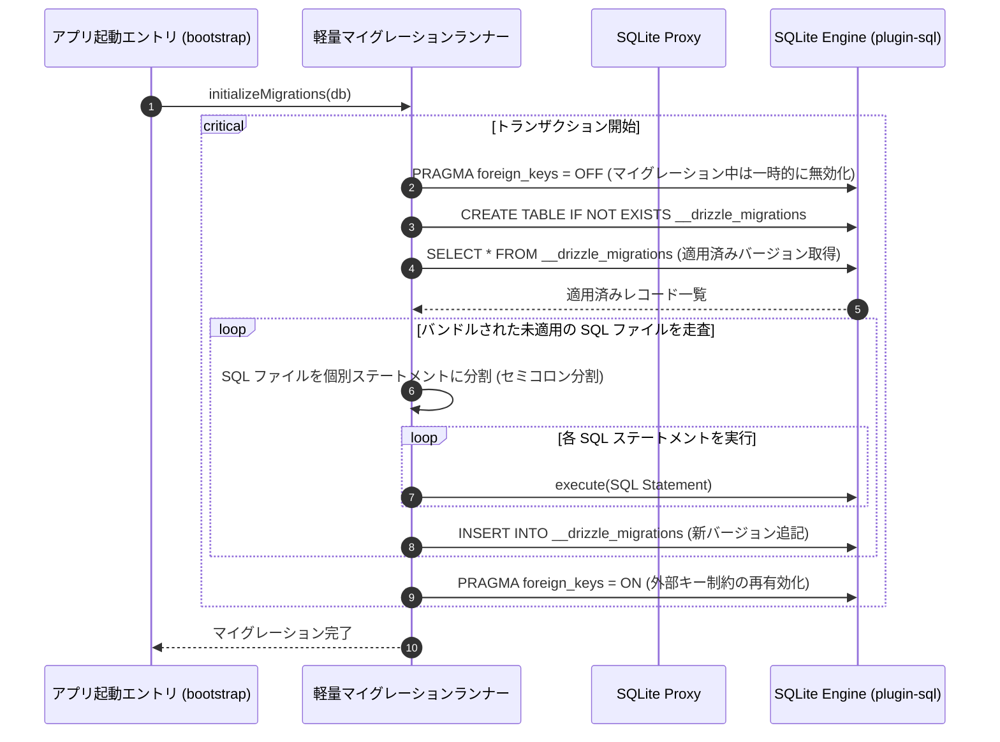

# SQLite Proxy 設計ガイドブック：drizzle-orm/sqlite-proxy ＋ @tauri-apps/plugin-sql を用いた型安全な SQLite バインディング

本ドキュメントは、`solid-imager` プロジェクトにおける Tauri (フロントエンド/クライアントサイド) のデータ保存層設計規範書です。以前の WASM ベースの PGlite 構成から、ネイティブ SQLite バインディングへの移行背景、Drizzle SQLite Proxy の動作原理、型マッピング戦略、テスト用の Mock コネクタ、および Vite の `raw` インポート機能を活用した自動マイグレーションの仕組みについて詳細に解説します。

---

## 1. 概要と背景

### PGlite (WASM) から Proxy SQLite への切り替え理由

旧ブランチ (`fix/issue-165-tauri`) では、ローカルデータ保存領域として **PGlite (WASMベースの PostgreSQL)** ＋ **IndexedDB** ＋ **relaxedDurability** の構成が採用されていました。しかし、実稼働において以下の決定的な課題と制限に直面しました。

#### ① 極度なパフォーマンスの低下 (ボトルネック)
WASM 仮想マシンによる SQL 解析・実行オーバーヘッドと、IndexedDB による物理ストレージへのシリアライズ・書き込み抽象化レイヤーの二重のオーバーヘッドが重なり、数千件におよぶメディアアイテムの一括スキャンやバルク挿入・更新処理で著しいレイテンシが生じ、ユーザーエクスペリエンスを大きく損ないました。

#### ② 不安定性とデータ破損リスク
ブラウザ環境におけるクォータ (容量制限) による不意の書き込み失敗や、IndexedDB 側の内部シリアライズエラーが多発しました。さらに、パフォーマンスを確保するために設定された `relaxedDurability: true` (OS レベルの同期書き込みをバイパスして遅延させるオプション) は、アプリの強制終了やメモリクラッシュが発生した際にトランザクションの永続性を失わせ、メタデータデータベース全体が修復不可能なレベルで破損する原因となりました。

### ネイティブ SQLite と Drizzle Proxy による解決

これらの致命的課題を克服するため、以下の新アプローチへと再構築しました。

```
【旧アーキテクチャ】
PGlite (WASM) ──> IndexedDB (relaxedDurability) ──> drizzle-orm/pglite ──> PostgreSQL Schema

【新アーキテクチャ】
@tauri-apps/plugin-sql (Tauri ネイティブ) ──> OS 物理 SQLite ──> drizzle-orm/sqlite-proxy ──> SQLite Schema
```

1. **OS ネイティブの信頼性と堅牢性:** `@tauri-apps/plugin-sql` を使用して、OS 側で提供されるネイティブの SQLite (C/C++ エンジン) に直接アクセス。IndexedDB や WASM の制約を受けず、トランザクションの ACID 特性をハードウェアおよび OS レベルで保証します。
2. **圧倒的なパフォーマンス向上:** IPC (プロセス間通信) 境界をまたぐ通信が発生するものの、OS の効率的なバッファキャッシュとディスク I/O 最適化により、PGlite と比較して検索および一括処理が圧倒的に高速化され、省メモリで動作します。
3. **シングル・ソース・オブ・トゥルース (Single Source of Truth) の維持:** Drizzle ORM の `sqlite-proxy` コネクタを介すことで、フロントエンドの TypeScript アプリケーション側では既存の Drizzle クエリビルダ (Type-Safe Builder) を 100% 活用できます。サーバーサイド (PostgreSQL) のスキーマ定義の型資産を、最小限の型マッピングルールを介して SQLite テーブルに完全に移植可能です。

---

## 2. Drizzle Proxy クライアント of 動作原理とコード実装例

### 動作原理と接続フロー

`drizzle-orm/sqlite-proxy` は、SQL の構築とクエリ結果のマッピング (TypeScript の型推論) を Drizzle が担当し、**実際の SQL 実行処理のみを外部のドライバー callback 関数に委譲する** ための特殊なコネクタです。

Tauri 環境では、フロントエンド (レンダラープロセス) が Drizzle クエリビルダを実行すると、Drizzle は内部で SQL 文字列とパラメータ配列を生成し、ユーザーが定義した callback 関数を呼び出します。この callback 関数が Tauri の IPC を経由して Rust 側の `@tauri-apps/plugin-sql` にクエリ実行を指示し、結果をフロントエンドに送り返します。

### 外部キー制約の有効化 (`PRAGMA foreign_keys = ON;`)

SQLite は後方互換性維持のため、デフォルトで **外部キー制約が無効 (`OFF`)** になっています。
これが無効のままだと、Drizzle のスキーマ定義で指定した `onDelete: "cascade"` や `onUpdate: "restrict"` などのカスケード削除や参照整合性チェックがデータベースエンジン側で一切無視されてしまいます。
これを防ぐため、データベースファイルをロードした直後 (コネクション確立時) に、必ず `PRAGMA foreign_keys = ON;` を実行します。

### Drizzle Proxy 戻り値の整合性適合 (結果セットのマッピング)

Drizzle Proxy は、実行する SQL の種類 (`method`) に応じて、ドライバが返すデータ構造を厳密に規定しています。これに準拠しない場合、Drizzle 内の型マッピング処理で例外や不正な値が発生します。

| `method` | 期待される挙動 | Drizzle が要求する戻り値の形状 | 適合処理の内容 |
|---|---|---|---|
| `run` | `INSERT`, `UPDATE`, `DELETE` 等の書き込み系 | `{ rows: [] }` | 行データは不要なため、空配列を返す。 |
| `values` | `db.select().values()` によるカラム配列取得 | `{ rows: any[][] }` | 各レコードがオブジェクトではなく、カラム値の「配列」の配列 (2次元配列) であることを期待するため、`Object.values(row)` で変換。 |
| `get` | `.findFirst()` 等による単一レコード取得 | `{ rows: [row] }` | 最初の一行だけを配列に包んで返す。 |
| `all` (またはデフォルト) | 通常の複数行の取得 | `{ rows: any[] }` | オブジェクトの配列をそのまま返す。 |

### コード実装例

以下は、`packages/db/src/sqlite/client.ts` に配置される Drizzle SQLite Proxy クライアントの完全な実装コードです。

```typescript
import { drizzle } from 'drizzle-orm/sqlite-proxy';
import Database from '@tauri-apps/plugin-sql';
import * as schema from './schema';

/**
 * Tauri のネイティブ SQLite プラグインを使用した Drizzle Proxy データベースを生成します。
 * @param dbPath データベースファイル名 (デフォルト: "solid_imager.db")
 */
export async function createSqliteProxyDb(dbPath = 'solid_imager.db') {
  // Tauri 環境下で動作するネイティブ SQLite ドライバを読み込み
  const tauriDb = await Database.load(`sqlite:${dbPath}`);

  // カスケード削除や参照整合性を正しく動作させるため、外部キー制約を有効化
  await tauriDb.execute('PRAGMA foreign_keys = ON;');

  // Drizzle Proxy クライアントの初期化
  return drizzle(
    async (sql, params, method) => {
      try {
        // 1. 書き込み系クエリ (run) の処理
        if (method === 'run') {
          await tauriDb.execute(sql, params);
          return { rows: [] };
        }

        // クエリを実行して結果セット (オブジェクトの配列) を取得
        const rows = await tauriDb.select<Record<string, unknown>[]>(sql, params);

        // 2. カラム値の2次元配列を要求するクエリ (values) の処理
        if (method === 'values') {
          const values = rows.map((row) => Object.values(row));
          return { rows: values };
        }

        // 3. 単一レコードを要求するクエリ (get) の処理
        if (method === 'get') {
          return { rows: rows.length > 0 ? [rows[0]] : [] };
        }

        // 4. 通常のクエリ (all) の処理
        return { rows };
      } catch (error) {
        console.error('SQLite Proxy Query Error:', { sql, params, error });
        throw error;
      }
    },
    { schema }
  );
}

export type SqliteDb = Awaited<ReturnType<typeof createSqliteProxyDb>>;
```

---

## 3. PostgreSQL から SQLite への型マッピング戦略

サーバー用 PostgreSQL スキーマとクライアント用 SQLite スキーマの間で、データ構造の統一性と型安全性を極限まで高めるため、以下のマッピング戦略を規定します。

### ① UUID のハンドリング
* **PostgreSQL:** `uuid` カラムに `defaultRandom()` を指定し、DBMS レベルで自動生成。
* **SQLite:** SQLite にはネイティブの UUID 型が存在しないため、`text` カラムを使用します。自動生成は JavaScript 側のランタイムで行うため、Drizzle の `$defaultFn` を利用して `crypto.randomUUID()` をバインドします。

```typescript
// PostgreSQL (参考)
export const media = pgTable('media', {
  id: uuid('id').primaryKey().defaultRandom(),
});

// SQLite マッピング
import { text, sqliteTable } from 'drizzle-orm/sqlite-core';

export const media = sqliteTable('media', {
  id: text('id')
    .primaryKey()
    .$defaultFn(() => crypto.randomUUID()),
});
```

### ② 列挙型 (Enum) のエミュレーション
* **PostgreSQL:** `pgEnum` を用いた強固なネイティブ列挙型を使用。
* **SQLite:** 列挙型が存在しないため、`text` 型を使用します。Drizzle の TypeScript レベルでの型定義オプション `{ enum: [...] }` を付与することで、コード上での不正な値の混入をコンパイルレベルで完全に防止します。

```typescript
// PostgreSQL (参考)
export const storageTypeEnum = pgEnum('storage_type', ['local', 'sftp', 's3']);

// SQLite マッピング
export const mediaSource = sqliteTable('media_source', {
  id: text('id').primaryKey().$defaultFn(() => crypto.randomUUID()),
  type: text('type', { enum: ['local', 'sftp', 's3'] }).notNull(),
});
```

### ③ JSON / JSONB 半構造化データの透過処理
* **PostgreSQL:** `jsonb` カラムを使用し、スキーマレベルで任意のインターフェース型を適用。
* **SQLite:** `text` 型を使用し、Drizzle の `{ mode: 'json' }` オプションを適用します。これにより、インフラ層のクエリ実行時に Drizzle が自動的に `JSON.stringify` (書き込み時) および `JSON.parse` (読み込み時) を実行するため、リポジトリ層のコードを変更することなくジェネリクス型定義をそのまま再利用できます。

```typescript
// SQLite マッピング
export const mediaSource = sqliteTable('media_source', {
  id: text('id').primaryKey().$defaultFn(() => crypto.randomUUID()),
  connectionInfo: text('connection_info', { mode: 'json' })
    .$type<ConnectionInfo>()
    .notNull(),
});
```

### ④ 日付時刻 (timestamp) のミリ秒精度エミュレーション
* **PostgreSQL:** タイムゾーン付き/なしの `timestamp` 型を使用。
* **SQLite:** `integer` 型を使用し、Drizzle の `{ mode: 'timestamp_ms' }` オプションを指定します。これによってデータベース内部にはエポックミリ秒の UNIX タイムスタンプ (整数値) として格納され、アプリケーション層では自動的に JavaScript の `Date` オブジェクトと相互変換されます。
* **メリット:** SQLite 内部で整数値として保存されるため、日付の範囲指定検索 (`BETWEEN`) やソート順序 (`ORDER BY`) が文字列表記による比較に比べて極めて厳密かつ高速に処理されます。

```typescript
// SQLite マッピング
import { integer } from 'drizzle-orm/sqlite-core';

export const media = sqliteTable('media', {
  id: text('id').primaryKey().$defaultFn(() => crypto.randomUUID()),
  createdAt: integer('created_at', { mode: 'timestamp_ms' })
    .notNull()
    .$defaultFn(() => new Date()),
});
```

---

## 4. CI / ローカル環境用の better-sqlite3 を用いた Mock コネクタ設計

### なぜ Mock コネクタが必要か？

Tauri アプリケーションの単体テスト/結合テストを実行する際、Node.js または Bun 環境 (Vitest) でテストが実行されるため、Tauri のネイティブ API (`@tauri-apps/plugin-sql` の Rust 接続部分) をロードできず、エラーが発生します。また、ローカルでブラウザ単独でフロントエンドの簡易モック動作を確認したい場合も同様です。

このため、テスト環境や非 Tauri 環境においては、Node.js 用の高速なインメモリ SQLite ドライバである `better-sqlite3` を使用し、Drizzle Proxy が要求するのと全く同一のインターフェースを備えた **Mock コネクタ** を介してデータベース接続を確立します。

### Mock コネクタの実装例 (`packages/db/src/sqlite/mock.ts`)

```typescript
import { drizzle } from 'drizzle-orm/sqlite-proxy';
import Database from 'better-sqlite3';
import * as schema from './schema';

/**
 * テスト/CI用の better-sqlite3 を使用したインメモリ SQLite Proxy データベースを生成します。
 */
export function createMockSqliteDb() {
  // インメモリ上にデータベースを新規構築
  const mockDb = new Database(':memory:');

  // テスト環境でもカスケード削除の挙動を検証するため、外部キー制約を有効化
  mockDb.exec('PRAGMA foreign_keys = ON;');

  return drizzle(
    async (sql, params, method) => {
      try {
        // better-sqlite3 のステートメントをプリペアドとして準備
        const stmt = mockDb.prepare(sql);

        // 1. 書き込み系クエリ (run) の処理
        if (method === 'run') {
          stmt.run(params);
          return { rows: [] };
        }

        // 2. カラム値の2次元配列を要求するクエリ (values) の処理
        if (method === 'values') {
          const rows = stmt.raw(true).all(params) as unknown[][];
          return { rows };
        }

        // 3. 単一レコードを要求するクエリ (get) の処理
        if (method === 'get') {
          const row = stmt.get(params);
          return { rows: row !== undefined ? [row] : [] };
        }

        // 4. 通常のクエリ (all) の処理
        const rows = stmt.all(params);
        return { rows };
      } catch (error) {
        console.error('Mock SQLite Proxy Query Error:', { sql, params, error });
        throw error;
      }
    },
    { schema }
  );
}
```

この Mock コネクタにより、リポジトリ層やビジネスロジック層のコードを本番環境 (Tauri / Rust) と全く変えることなく、Vitest で高速かつ堅牢にデータベーステストを回すことが可能になります。

---

## 5. Vite raw マイグレーションランナーの仕組みと起動時実行フロー

### 課題：フロントエンドにおけるマイグレーション制限

通常の Drizzle migrations (`drizzle-kit push` や `drizzle-orm/node-postgres/migrator`) は、Node.js の `fs` (ファイルシステム) や `path` モジュールに強く依存しており、かつビルド後の成果物がユーザーのローカル環境に散らばるため、Tauri レンダラープロセス (ブラウザと同等のセキュリティサンドボックス) では動作しません。

これを克服するため、Vite の **`raw` バンドル** 機能を用いて SQL マイグレーションファイルを事前に JavaScript バンドル内に文字列として埋め込み、アプリ起動時にブラウザプロセス内で解析・順次実行する **軽量マイグレーションランナー** を自作します。

### 起動時の実行フロー



### 軽量マイグレーションランナーの実装例 (`packages/db/src/sqlite/migrations.ts`)

以下は、Vite で raw インポートした複数のマイグレーション用 SQL ファイルを適用順に並え、初期化トランザクション内で実行する具体的な実装例です。

```typescript
import type { SqliteDb } from './client';

// Vite のインポート機能を使用して、マイグレーション SQL ファイル群を文字列として事前バンドル
// 例: /migrations/0000_init.sql, /migrations/0001_add_index.sql
// 実際のファイル構成に合わせて、本番アセットから eager で読み込みます。
const migrationsGlob = import.meta.glob('./migrations/*.sql', {
  query: '?raw',
  eager: true,
}) as Record<string, { default: string }>;

/**
 * 読み込まれた SQL 文字列から、安全に実行可能な単一ステートメント群に分割します。
 * (注: コメント行の除去や、不要な空行のフィルタリングを行います)
 */
function parseSqlStatements(sqlText: string): string[] {
  return sqlText
    .split(';')
    .map((statement) => statement.trim())
    .filter((statement) => {
      if (statement.length === 0) return false;
      // コメント行のみのステートメントを除外
      if (statement.startsWith('--')) return false;
      return true;
    });
}

/**
 * SQLite データベースの自動マイグレーションをアプリ起動時に実行します。
 */
export async function migrateTauriDb(db: SqliteDb) {
  // 1. マイグレーション管理用テーブルを生成
  await db.run(
    `CREATE TABLE IF NOT EXISTS __drizzle_migrations (
      id INTEGER PRIMARY KEY AUTOINCREMENT,
      hash TEXT NOT NULL,
      created_at INTEGER NOT NULL
    );`
  );

  // 2. 適用済みのマイグレーションハッシュの一覧を取得
  const appliedMigrations = await db
    .select({ hash: '__drizzle_migrations.hash' })
    .from({ name: '__drizzle_migrations' } as any)
    .execute() as { hash: string }[];

  const appliedHashSet = new Set(appliedMigrations.map((m) => m.hash));

  // 3. バンドルされている SQL ファイルをソートして処理
  const migrationFiles = Object.keys(migrationsGlob).sort();

  for (const filePath of migrationFiles) {
    // パス名からハッシュ値（例: "0000_xxxx"）を生成してキーとする
    const hash = filePath.replace(/^.*\/migrations\//, '').replace(/\.sql$/, '');

    // すでに適用済みの場合はスキップ
    if (appliedHashSet.has(hash)) {
      continue;
    }

    const sqlContent = migrationsGlob[filePath].default;
    const statements = parseSqlStatements(sqlContent);

    console.info(`Applying database migration: ${hash}`);

    // Drizzle のトランザクション機能を使用して適用をアトミックに保証
    await db.transaction(async (tx) => {
      // マイグレーション中は外部キー制約の競合を防ぐため一時的に無効化
      await tx.run('PRAGMA foreign_keys = OFF;');

      for (const statement of statements) {
        await tx.run(`${statement};`);
      }

      // バージョン管理テーブルに記録
      await tx.run(
        'INSERT INTO __drizzle_migrations (hash, created_at) VALUES (?, ?);',
        [hash, Date.now()]
      );

      // マイグレーション完了後に外部キー制約を再有効化
      await tx.run('PRAGMA foreign_keys = ON;');
    });

    console.info(`Migration ${hash} successfully applied.`);
  }
}
```

### アプリケーション起動時の初期化フロー

アプリの起動ロジック (`apps/tauri/src/bootstrap.ts`) において、データベースクライアントを初期化した直後に上記の `migrateTauriDb` を呼び出すことで、エンドユーザーにマイグレーション作業を意識させることなく、スキーマを常に最新のバージョンに保つことができます。

```typescript
import { createSqliteProxyDb } from '@solid-imager/db/sqlite/client';
import { migrateTauriDb } from '@solid-imager/db/sqlite/migrations';

export async function bootstrapApplication() {
  console.info('Initializing application database...');

  // 1. Drizzle SQLite Proxy クライアントの初期化 (接続確立と外部キー有効化)
  const db = await createSqliteProxyDb('solid_imager_local.db');

  // 2. Vite raw 方式による自動マイグレーション実行
  try {
    await migrateTauriDb(db);
    console.info('Database migration completed successfully.');
  } catch (error) {
    console.error('Fatal: Database migration failed.', error);
    // 起動処理を中断、または適切なオフラインエラーUIを表示する
    throw error;
  }

  // 3. その他のアプリケーションサービス (DIコンテナ等) の初期化
  // ...
  return { db };
}
```

---

## 6. 開発ガイドラインとレビュー時のチェックリスト

SQLite Proxy を導入した環境下で新規機能の実装やテーブルの追加を行う開発者は、以下のチェックリストを遵守してください。

- [ ] **スキーマの定義:** `packages/db/src/sqlite/schema.ts` に新規テーブルを追加する際は、必ず PostgreSQL スキーマ (`packages/db/src/schema.ts`) と一対一で対応していることを確認すること。
- [ ] **データ型制限:** UUID に `crypto.randomUUID()` が `$defaultFn` としてバインドされているか？ Enum が `text` 型と `{ enum: [...] }` を組み合わせて定義されているか？ JSON は `{ mode: 'json' }` になっているか？ timestamp は `integer` かつ `{ mode: 'timestamp_ms' }` が指定されているか？
- [ ] **マイグレーションの生成:** スキーマ変更後は `bun drizzle-kit generate` 等で SQLite 用の SQL ファイルを作成し、`packages/db/src/sqlite/migrations/` 配下に格納すること。
- [ ] **テストの実行:** `vp test` を実行し、インメモリ Mock コネクタ (`better-sqlite3`) でテストがエラーなしで通ることを確認すること。
- [ ] **外部キーの考慮:** カスケード削除が期待されるリレーションにおいて、親レコードの削除で子レコードが自動削除されるかテストで検証すること。
