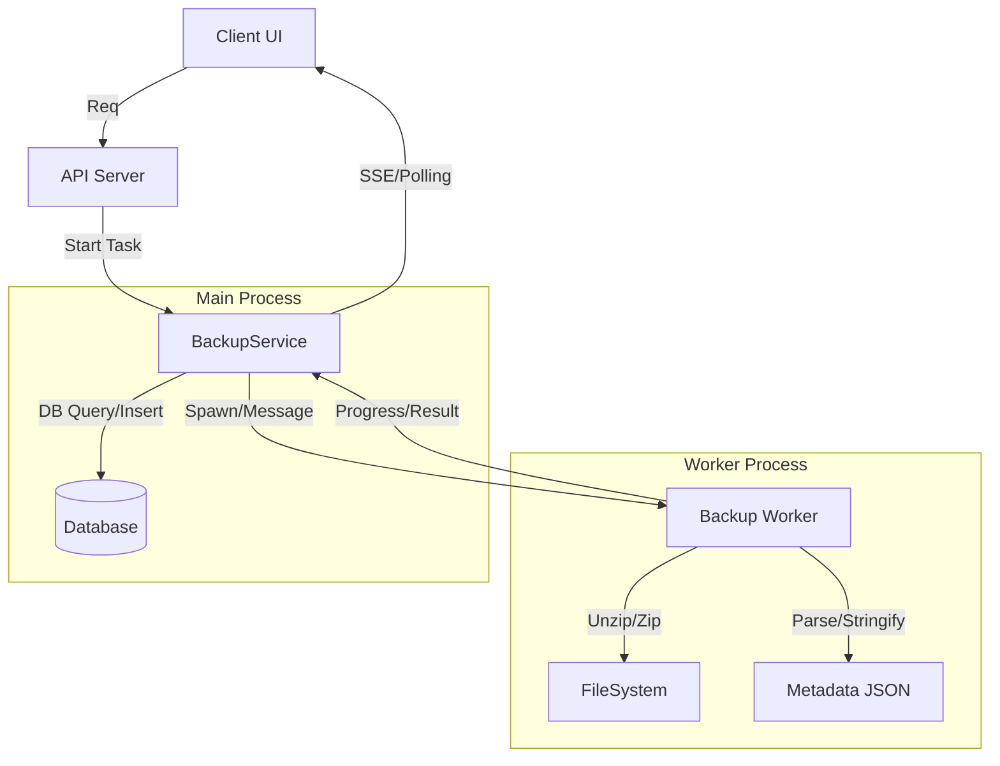

# Bun API & Worker Implementation Spec

## 1. 目的と課題
現状のZIPエクスポート/インポート処理において、以下の課題が発生しているため、Bun固有APIおよびWorkerを活用して解決を図る。

- **課題**:
  - 大容量ZIPの処理中にメインスレッドがブロックされ、UI操作（画面遷移など）が不能になる。
  - 処理後のメモリ解放が遅い、またはガベージコレクションが追いつかない。
  - Node.js互換の `fs` やストリーム処理では、大量のファイルI/Oでボトルネックになりやすい。

- **目標**:
  - **プロセス分離**: 重い処理をWorkerに逃がし、メインスレッド（UI/サーバーレスポンス）の快適性を維持する。
  - **高速化**: `Bun.file`, `Bun.write` 等の高速なネイティブ実装を利用する。
  - **メモリ効率**: ストリーム処理を徹底し、メモリに乗らないサイズのファイルも扱えるようにする。

## 2. 採用技術・API

### 採用
- **Bun.Worker**: Web Standard API互換かつ高速なWorker実装。ファイルのロードが容易。
- **Bun.file**: ファイル参照の高速化。Lazy loading。
- **Bun.write**: 高速なファイル書き込み。システムコール呼び出しの最適化。
- **Transferable Objects**: Worker間のデータ転送コスト削減（ArrayBufferなど）。

### 不採用 / 保留
- **Bun.transpiler**: 現状は必要なし。

## 3. アーキテクチャ設計

### 3.1 構成
アプリケーション層から独立した `BackupWorker` を作成し、バックグラウンドでImport/Exportを実行する。



### 3.2 責任分界点

| 処理 | 担当 | 理由 |
| :--- | :--- | :--- |
| DB読み書き | **Main Process** | DBコネクション（特にPGlite）はメインスレッドで管理すべき。競合回避。 |
| ZIP圧縮/解凍 | **Worker** | CPUバウンドな処理。メインスレッドをブロックする主因。 |
| JSONパース/生成 | **Worker** | 大量データのパースはCPUコストが高い。 |
| 画像ファイルI/O | **Worker** | I/Oバウンドだが、数が多いとイベントループを圧迫する。 |

## 4. 実装詳細

### 4.1 Import フロー (ZIP Upload -> DB)
1.  **Upload**: クライアントから一時ディレクトリにZIPをアップロード。
2.  **Dispatch**: `BackupService` がZIPパスを `BackupWorker` に送信。
3.  **Unzip (Worker)**:
    - `unzipper` 等で展開。
    - `dump.json` を読み、パース結果を返すのではなく、**必要な情報だけ抽出**するか、または**ファイルパス**として管理する。
    - 画像ファイルは一時ディレクトリ (`.cache/restore-temp/<id>/`) に展開。`Bun.write` を使用。
4.  **Notify (Worker -> Main)**:
    - 展開完了と、メタデータ（JSONオブジェクトまたはJSONファイルのパス）をメインスレッドに通知。
5.  **DB Insert (Main)**:
    - メインスレッドがメタデータを受け取り、DBにバルクインサート（既存ロジック再利用）。
6.  **Move Files (Main/Worker)**:
    - DB登録成功後、画像を正規の保存場所 (`source.connectionInfo.path`) に移動。
    - ※ ここもWorkerにやらせたいが、ドライバの抽象化を守るため、Workerには「移動元」「移動先」のリストを渡して `Bun.write` (copy) させるのが高速。

### 4.2 Export フロー (DB -> ZIP Download)
1.  **Query (Main)**:
    - DBからメタデータをチャンク（例: 1000件ごと）で取得。
    - JSON化に必要なデータ構造へ変換。
2.  **Stream (Main -> Worker)**:
    - 変換したデータをWorkerへメッセージ送信（`postMessage`）。
    - 完全に全データをメモリに乗せず、逐次送る。
3.  **Zip (Worker)**:
    - `archiver` 等を使用。
    - 受け取ったメタデータを `dump.json` としてZIPストリームに追加。
    - 指定されたファイルパス（画像）を読み (`Bun.file`)、ZIPに追加。
4.  **Output (Worker)**:
    - 最終的なZIPファイルを一時パスに出力。
    - 完了後、パスをメインスレッドに通知。
5.  **Download (Main)**:
    - 生成されたZIPをクライアントにレスポンス（ストリーム配信）。

## 5. ロックイン対策 (Portability)
Bun APIへの依存を局所化し、将来的なNode.jsへの移行（戻し）を容易にする。

- **抽象化**: Worker内のファイル操作処理を関数に切り出し、環境変数 `BUN_RUNTIME` 等で分岐、あるいはDI可能な構造にする。
- **Polyfill**: `Bun.file` や `Bun.write` に相当する処理は、Node.jsでは `fs.promises` で容易に代替可能。
- **Worker**: Web Worker API (`new Worker`, `postMessage`) はNode.jsでも `worker_threads` やアダプタで互換性を持たせやすい。

## 6. Worker実装イメージ

```typescript
// src/workers/backup.worker.ts
declare var self: Worker;

import { join } from "path";
// Bun-specific optimizations
const write = Bun.write;
const file = Bun.file;

self.onmessage = async (event: MessageEvent) => {
  const { type, payload } = event.data;
  
  try {
    if (type === "IMPORT") {
      await handleImport(payload);
    } else if (type === "EXPORT") {
      await handleExport(payload);
    }
  } catch (err) {
    self.postMessage({ type: "ERROR", error: err.message });
  }
};

async function handleImport({ zipPath, extractPath }: any) {
  // Use unzipper or similar logic
  // Utilize Bun.write for extracted files
  // ...
  self.postMessage({ type: "IMPORT_COMPLETE", metaPath: ... });
}
```

## 7. 次のアクション
1.  `src/workers/backup.worker.ts` の作成。
2.  `BackupService` の改修（Worker呼び出し処理の追加）。
3.  `tsconfig.json` 等でWorkerのビルド設定が必要か確認（Bunならそのままtsを実行可能なので不要なはず）。

## 8. その他の活用候補 (Roadmap)

バックアップ処理以外で、パフォーマンス向上やコード簡素化に寄与するBun APIの活用案。

### 8.1 `Bun.spawn` (Subprocess Management)
- **現状**: `src/infrastructure/processing/image-processor.ts` や `download-jobs.ts` で `node:child_process` の `execFile` を使用している。
- **提案**: `Bun.spawn` への置き換え。
- **メリット**:
  - `child_process` よりも起動オーバーヘッドが小さく、メモリ効率が良い。
  - ReadableStream / WritableStream ベースのモダンなI/Oハンドリングが可能。
- **注意点**: `fluent-ffmpeg` などのライブラリが内部で `child_process` を使っている場合、そこまで手を入れるのはコストが高い。自前でコマンドを叩いている箇所（AIサービス起動など）から適用する。

### 8.2 `Bun.env` (Environment Variables)
- **現状**: `dotenv` パッケージを使用して `.env` ファイルを読み込んでいる。
- **提案**: `Bun.env` (ネイティブサポート) への移行。
- **メリット**:
  - `dotenv` 依存の削除。
  - 起動時のロード時間が（微々たるものだが）短縮。
  - コード上で明示的な `dotenv.config()` 呼び出しが不要になる。

### 8.3 `Bun.hash` & `Bun.Crypto` (Hashing)
- **現状**: `src/domain/media/utils/hash-utils.ts` で `node:crypto` を使用。
- **提案**:
  - **暗号学的ハッシュ**: `Bun.SHA256` 等の使用（Web Crypto APIのBun最適化実装）。`Bun.file(path).arrayBuffer()` と組み合わせることで、ファイルハッシュ計算を高速化できる可能性がある。
  - **非暗号学的ハッシュ**: キャッシュキー生成やETag計算には、爆速な `Bun.hash` (MurmurHash) を採用する。
- **課題**: 既存のDBに保存されているハッシュ値（SHA256等）との整合性。新規のキャッシュ機構等の独立した箇所から導入を検討。

  - **課題**: `vi.mock` 等のVitest固有APIを使用しているため、`mock.module` 等への書き換えコストが発生する。当面はVitest on Bunで十分か。

## 9. Tauri 移行時の考慮事項 (Risks & Mitigation)

将来的に **Tauri** (デスクトップアプリ化) を検討している場合、Bun固有APIの使用は「ポータビリティの低下」という大きなリスクを伴う。

### 9.1 リスクの所在
Tauri アプリケーション（WebView側）はブラウザ環境であり、**Node.js API や Bun API は一切存在しない**。
バックエンドロジックを Tauri の Rust プロセス、あるいはフロントエンドの WebView に移行する際、`Bun.xxx` で記述されたコードは動作しなくなる。

| 機能カテゴリ | Bun API (Server Side) | Tauri API (Client/Rust Side) | 互換性 |
| :--- | :--- | :--- | :--- |
| **File I/O** | `Bun.file`, `Bun.write` | `@tauri-apps/plugin-fs` (JS) / `std::fs` (Rust) | × (API体系が異なる) |
| **Process** | `Bun.spawn` | `@tauri-apps/plugin-shell` (JS) / `std::process` (Rust) | × (API体系が異なる) |
| **Hashing** | `Bun.hash` | Rust Crates (`sha2`, etc.) | × |
| **Worker** | `Bun.Worker` | Web Worker (Browser Standard) / Rust Threads | △ (Web Workerなら動くがBun APIは呼べない) |

### 9.2 対策: 抽象化レイヤー (Adapter Pattern)
Bun API を直接ビジネスロジック内に記述せず、必ず **Interface (Adapter)** を介して利用する設計とする。これにより、Tauri 移行時は Adapter を差し替えるだけで対応可能にする。

#### 設計例: FileSystem
```typescript
// domain/interfaces/file-system.ts
export interface IFileSystem {
  read(path: string): Promise<ArrayBuffer>;
  write(path: string, content: ArrayBuffer): Promise<void>;
  exists(path: string): Promise<boolean>;
}

// infrastructure/bun/bun-file-system.ts (Current)
export class BunFileSystem implements IFileSystem {
  async read(path: string) { return await Bun.file(path).arrayBuffer(); }
  async write(path: string, content: ArrayBuffer) { await Bun.write(path, content); }
  // ...
}

// infrastructure/tauri/tauri-file-system.ts (Future)
import { readFile, writeFile } from '@tauri-apps/plugin-fs';
export class TauriFileSystem implements IFileSystem {
  async read(path: string) { return await readFile(path); }
  // ...
}
```

### 9.3 結論

- **Bun API採用はGO**とするが、**「直接呼び出し禁止」**をルールとする。

- 特に `BackupService` や `ImageProcessor` などのコアロジックでは、DI (Dependency Injection) パターンを用いてファイルシステムやプロセス実行の実装を注入できるように設計する。

- この方針は [Client-Server Architecture Proposal](../architecture/client-server-proposal.md) の **Phase 2: データレイヤーの抽象化** の一環として実施する。
