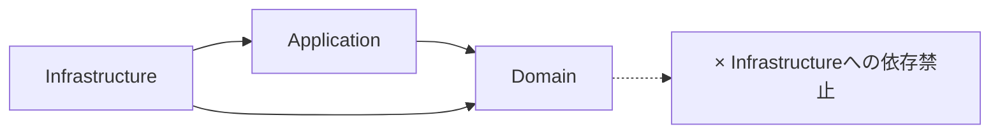

# drizzle-zod 導入検討と設計方針

## 1. 背景と目的

現在、`src/infrastructure/db/schema.ts`（Drizzle ORMによるDB定義）と、`src/domain/**/schemas.ts`（Zodによるドメイン/バリデーション定義）の間で、類似したスキーマ定義が重複して存在している。

この「二重管理」状態には以下の課題がある：
1.  **保守コスト**: DBカラムを追加・変更した際、Zodスキーマ側も手動で追従させる必要があり、手間がかかる。
2.  **不整合リスク**: 修正漏れにより、DBの実態とバリデーションルールに乖離が生じる可能性がある（例：DBでは `nullable` だが Zod では `required` になっている等）。

`drizzle-zod` を導入し、Drizzle のテーブル定義から Zod スキーマを自動生成することで、これらの課題を解決し、**Single Source of Truth（信頼できる唯一の情報源）** をDB定義に一本化することを目指す検討を行った。

## 2. 現状分析とアーキテクチャ上の制約

本プロジェクトは **クリーンアーキテクチャ** を採用しており、以下の依存方向ルールを厳守する必要がある。



### 2.1. 依存関係の壁
- `drizzle-zod` は、`src/infrastructure/db/schema.ts` (Infrastructure層) に定義されたテーブルオブジェクトを入力として Zod スキーマを生成する。
- もし、ドメイン層にある `src/domain/media/schemas.ts` を `drizzle-zod` で生成したコードに置き換えると、**Domain層がInfrastructure層（Drizzleの定義）に直接依存する** ことになる。
- これはクリーンアーキテクチャの原則違反であり、ドメインモデルがDBの物理構造や特定のライブラリに強く結合してしまうため、許容すべきではない。

### 2.2. スキーマの質の乖離
- **DBスキーマ (Drizzle)**: データの物理的な型（varchar, integer）、制約（NOT NULL, UNIQUE）を定義する。
- **ドメインスキーマ (Zod)**: ビジネスルール（例:「年齢は0以上」「メールアドレスの形式」）、ユーザー向けのカスタムエラーメッセージ、UI表示用の変換などを担う。
- `drizzle-zod` が自動生成するのは前者の「物理制約」に基づくバリデーションであり、ドメイン層が要求するリッチなバリデーションとは必ずしも一致しない。

## 3. 導入の是非と結論

**結論: ドメイン層のスキーマ (`src/domain/**/*.ts`) を `drizzle-zod` で置き換えることは行わない。**

当初の懸念通り、「後からドメイン層のスキーマをこれに置き換えるのは破壊的変更となり、かつアーキテクチャ違反を招くため推奨されない」。

ただし、**Infrastructure層やPresentation層（API定義）においては有効** であるため、以下の限定的な範囲での導入を設計方針とする。

## 4. 推奨される導入・活用方針

`drizzle-zod` は「ドメインロジックの核」ではなく、「インフラ/API境界のボイラープレート削減」のために利用する。

### 4.1. 適用範囲

1.  **API リクエスト/レスポンスの型定義 (Infrastructure/Presentation)**
    - 単純な CRUD API において、リクエストボディの検証を行う際、手動で Zod スキーマを書く代わりに `createInsertSchema` を利用する。
    - 特に、管理画面や内部ツール向けのAPIなど、ビジネスロジックが薄くDB直結型の操作を行う箇所で効果が高い。

2.  **データ移行・初期データの投入 (Infrastructure)**
    - シードデータのバリデーションや、CSVインポート処理など、Infrastructure層内で完結する処理において利用する。

3.  **統合テスト (Tests)**
    - APIテスト等で、期待されるレスポンス形式の検証や、テストデータ生成時の型整合性チェックに利用する。

### 4.2. 実装イメージ

**Infrastructure層に Zod スキーマ定義を集約するファイルを作成**

```typescript
// src/infrastructure/db/zod-schemas.ts
import { createInsertSchema, createSelectSchema } from 'drizzle-zod';
import { medias, tags } from './schema';
import { z } from 'zod';

// 基本的なスキーマの生成
export const insertMediaSchema = createInsertSchema(medias);
export const selectMediaSchema = createSelectSchema(medias);

// 必要に応じて拡張・調整（Presentation層向け）
export const updateMediaApiSchema = insertMediaSchema.pick({
    description: true,
    status: true,
}).extend({
    // DBにはないがAPIで必要なフィールドを追加
    tagIds: z.array(z.string().uuid()).optional(),
});
```

**Route/Controllerでの利用**

```typescript
// src/routes/api/media.ts
import { insertMediaSchema } from '~/infrastructure/db/zod-schemas';

// ...
app.post('/media', async (c) => {
    const body = await c.req.json();
    // Drizzle定義ベースで検証
    const result = insertMediaSchema.safeParse(body);
    if (!result.success) {
        return c.json({ error: result.error }, 400);
    }
    // ...
});
```

## 5. リスク管理と注意点

1.  **Refine/Transform の消失**
    - 手動定義していた Zod スキーマに含まれる `.refine()`（相関チェック）や `.transform()`（値の加工）は、自動生成では引き継がれない。これらが必要な箇所では `drizzle-zod` の生成物をベースに `.extend()` するか、手動定義を維持する必要がある。

2.  **エラーメッセージ**
    - 自動生成されるエラーメッセージは機械的なもの（例: "Expected string, received number"）になる。ユーザーフレンドリーなメッセージが必要なバリデーションには向かない。

3.  **依存の分離**
    - ドメイン層のコード内で `import { ... } from 'drizzle-zod'` や、Drizzleスキーマへのimportが発生しないよう、コードレビューで厳重にチェックする。

## 6. まとめ

- **採用**: する（ただし限定的利用）。
- **目的**: インフラ層・API層でのコード記述量削減と、DBスキーマ変更への追従性向上。
- **禁止事項**: ドメイン層の既存 Zod スキーマの置き換え。ドメイン層からのインポート。
- **ネクストアクション**:
    - `bun add drizzle-zod` の実施。
    - `src/infrastructure/db/validation.ts` (仮) 等を作成し、試験的に一部のAPIで利用を開始する。
